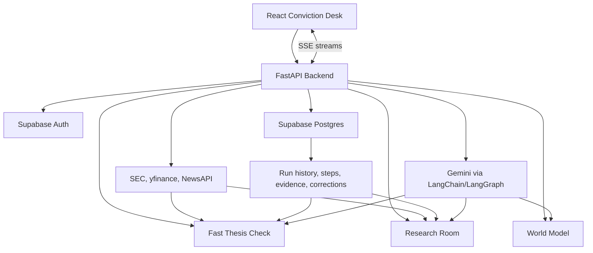

# StockSense Conviction Desk

> Evidence-backed investment research that tests what you believe, shows what changed, and keeps a traceable record of conviction over time.

[](https://www.python.org/)
[](https://fastapi.tiangolo.com/)
[](https://react.dev/)
[](https://www.typescriptlang.org/)
[](https://supabase.com/)
[](LICENSE)

StockSense is not a stock-picking chatbot. It is a research desk for investors who want to save a thesis, attack it with fresh evidence, and see whether their belief strengthened, weakened, broke, or still lacks proof.

## Product

StockSense has three core surfaces:

| Surface | What it does |
| --- | --- |
| Thesis Desk | Stores investment theses, kill criteria, alerts, correction memory, and conviction-check history. |
| Research Room | Runs evidence-first ticker investigations across SEC filings, company facts, price, fundamentals, news, and prior evidence. |
| World Model | Converts a thesis into claims, observables, forecast questions, scenario paths, and calibration records. |

The system is designed around a simple rule: collect and validate evidence before generating confident prose.

## Architecture



See [docs/ARCHITECTURE.md](docs/ARCHITECTURE.md) for the full system map.

## Tech Stack

| Layer | Stack |
| --- | --- |
| Frontend | React 19, Vite 7, TypeScript, Tailwind, TanStack Query, Supabase client |
| Backend | FastAPI, Uvicorn, Pydantic v2, Server-Sent Events |
| Agents | Gemini, LangChain, LangGraph, structured outputs, evidence validation |
| Data | SEC EDGAR APIs, yfinance, NewsAPI, Supabase Postgres |
| Persistence | Supabase Auth, RLS, run tables, evidence tables, claim/forecast/scenario tables |
| Tooling | uv, pnpm, pytest, Vite build |

## Quick Start

### Prerequisites

- Python 3.11+
- [uv](https://docs.astral.sh/uv/)
- Node.js 20+
- [pnpm](https://pnpm.io/)
- Google Gemini API key
- NewsAPI key
- Supabase project
- SEC EDGAR user agent with contact information

### Install

```bash
uv sync

cd frontend
pnpm install
cd ..
```

### Configure

```bash
cp .env.example .env
cp frontend/.env.example frontend/.env
```

Fill in the backend and frontend environment files. The required variables are documented in [docs/DEVELOPMENT.md](docs/DEVELOPMENT.md).

### Apply Supabase Schema

Run the base schema and migrations in order:

```text
supabase/schema.sql
supabase/migrations/000_core_schema_baseline.sql
supabase/migrations/001_stage4_features.sql
supabase/migrations/002_phase2_watchman.sql
supabase/migrations/003_analysis_cache.sql
supabase/migrations/004_add_ticker_unique.sql
supabase/migrations/005_analysis_traces.sql
supabase/migrations/006_alert_history_rls_policies.sql
supabase/migrations/007_thesis_forensics_runs.sql
supabase/migrations/008_agent_runs_and_evidence_memory.sql
supabase/migrations/009_conviction_world_model.sql
supabase/migrations/010_lock_analysis_cache_writes.sql
```

Migration `008_agent_runs_and_evidence_memory.sql` uses the Supabase `vector` extension.

### Run Locally

```bash
# Terminal 1
uv run python -m stocksense.main

# Terminal 2
cd frontend
pnpm run dev
```

Open:

```text
http://localhost:5173
```

Smoke test:

```bash
curl http://127.0.0.1:8000/health
curl http://127.0.0.1:8000/cached-tickers
```

## Documentation

| Document | Purpose |
| --- | --- |
| [Architecture](docs/ARCHITECTURE.md) | Runtime map, workflows, persistence model, reliability boundaries |
| [API](docs/API.md) | Public, authenticated, thesis-check, Research Room, and World Model routes |
| [Development](docs/DEVELOPMENT.md) | Local setup, dependency policy, migrations, tests, coding contracts |
| [Deployment](docs/DEPLOYMENT.md) | Cloud Run, Render, frontend hosting, production checks |
| [Contributing](CONTRIBUTING.md) | Contribution workflow, quality bar, testing expectations |

## Core Commands

```bash
# Backend tests
uv run pytest tests -v

# Frontend checks
cd frontend
pnpm run typecheck
pnpm run build
```

Python dependency management is uv-first. `pyproject.toml` is the dependency source of truth, `uv.lock` is the reproducible lockfile, and `requirements*.txt` files are compatibility exports only.

## Project Structure

```text
stocksense/      FastAPI backend, agents, orchestration, schemas, persistence
frontend/        React Conviction Desk frontend
supabase/        Base schema and migrations
tests/           Backend contract, route, orchestration, and schema tests
docs/            Public project documentation
```

## Disclaimer

StockSense is for research and educational use. It does not provide investment advice, trading recommendations, or fiduciary guidance. Always verify conclusions against primary sources before making financial decisions.

## License

Apache License 2.0. See [LICENSE](LICENSE).
