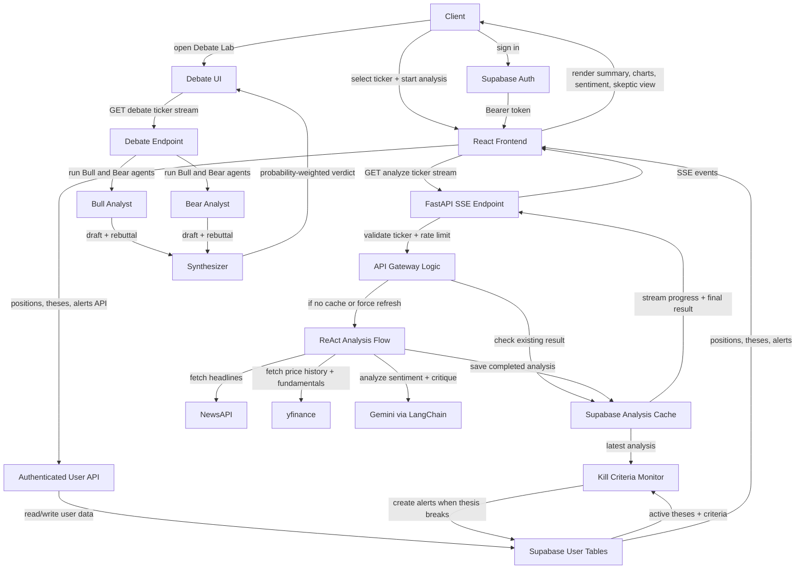

# StockSense Flow Architecture

This is the simplest walkthrough version of the system. It shows the main user journey, the core analysis pipeline, and how saved theses and alerts connect back to the analysis.

## Walkthrough

1. The client starts from the React frontend and requests a stock analysis.
2. FastAPI receives the streaming request, validates the ticker, and checks rate limits.
3. The backend first checks whether a cached analysis already exists in Supabase.
4. If cached data is available, it returns quickly. If not, the ReAct flow runs.
5. The ReAct flow gathers market evidence from NewsAPI and yfinance, then uses Gemini to interpret sentiment and generate the final analysis.
6. That analysis is saved back into Supabase and streamed to the frontend over SSE.
7. If the user opens Debate Lab, a separate Bull vs Bear flow runs and the Synthesizer produces the final verdict.
8. If the user is signed in, the frontend can also read and write positions, theses, and kill alerts through authenticated API routes.
9. New analyses are checked against saved thesis kill criteria, and alerts are created when a thesis is invalidated.