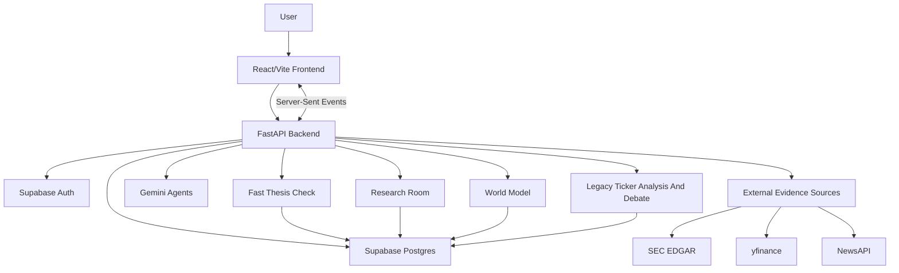
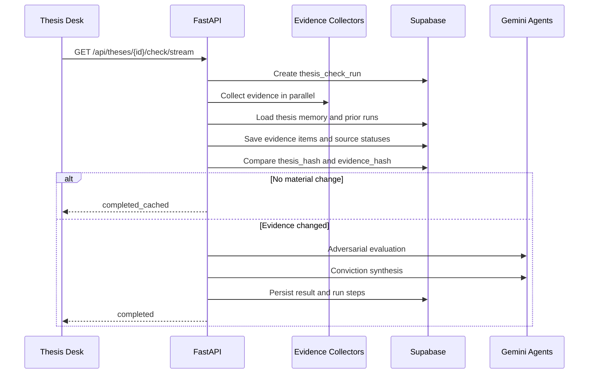

# Architecture

StockSense Conviction Desk is a full-stack investment research system built around persistent theses, evidence-backed agent runs, and visible source health.

The product has three main runtime surfaces:

- **Thesis Desk**: saved theses, kill criteria, alerts, correction memory, and fast conviction checks.
- **Research Room**: evidence-first ticker investigations that produce a memo and draft thesis.
- **World Model**: claim graphs, observables, forecast questions, scenario paths, and calibration.

## System Overview

## Backend Map

| Area | Files | Responsibility |
| --- | --- | --- |
| API entry point | `stocksense/main.py` | FastAPI app, health checks, CORS, rate limiting, legacy analysis routes, SSE routes |
| API routers | `stocksense/api/*` | Authenticated user, thesis-check, Research Room, and World Model routes |
| Orchestration | `stocksense/orchestration/*` | Run lifecycle, evidence collection, agent calls, synthesis, scenario compilation |
| Core schemas and utilities | `stocksense/core/*` | Pydantic contracts, SEC adapter, data collectors, LLM config, parsing, validation, calibration |
| Persistence | `stocksense/db/*` | Supabase clients, run persistence, evidence memory, analysis cache, trace helpers |
| Agents | `stocksense/agents/*` | Bull, bear, skeptic, and synthesizer roles for legacy/debate flows |

## Frontend Map

| Area | Files | Responsibility |
| --- | --- | --- |
| App shell | `frontend/src/App.tsx`, `frontend/src/features/conviction/DeskShell.tsx` | Product shell, navigation, backend status, auth entry points |
| Conviction features | `frontend/src/features/conviction/*` | Thesis Desk, Research Room, evidence receipts, run inspector, alerts, World Model panels |
| API clients | `frontend/src/api/*` | REST clients and typed domain requests |
| Streaming hooks | `frontend/src/hooks/*Stream.ts` | SSE clients for analysis, debate, thesis check, and Research Room |
| Context | `frontend/src/context/*` | Auth, theme, sidebar, and UI state providers |

## Workflow: Fast Thesis Check

Key files:

- `stocksense/orchestration/thesis_check.py`
- `stocksense/orchestration/thesis_evidence.py`
- `stocksense/orchestration/thesis_memory.py`
- `stocksense/orchestration/thesis_agents.py`
- `stocksense/db/thesis_forensics.py`
- `frontend/src/hooks/useThesisCheckStream.ts`
- `frontend/src/features/conviction/RunInspector.tsx`

## Workflow: Research Room

Research Room starts with a ticker and question, then builds a typed run:

1. Create an `agent_runs` record with `run_type = research_room`.
2. Emit a research plan.
3. Collect SEC submissions, SEC company facts, price, fundamentals, and news.
4. Persist source documents and evidence chunks when available.
5. Retrieve prior evidence with Postgres full-text search.
6. Rank evidence for analyst context.
7. Run planner/analyst/contradiction/referee/memo logic.
8. Persist final result and stream it to the UI.

Key files:

- `stocksense/orchestration/research_room.py`
- `stocksense/orchestration/research_room_evidence.py`
- `stocksense/orchestration/research_room_agents.py`
- `stocksense/db/run_controller.py`
- `stocksense/db/evidence_memory.py`
- `frontend/src/hooks/useResearchRoomStream.ts`
- `frontend/src/features/conviction/ResearchRoom.tsx`

## Workflow: World Model

World Model converts a thesis into falsifiable components:

- claims
- observables
- evidence requirements
- forecast questions
- scenario paths
- resolved forecast outcomes and Brier scores

Key files:

- `stocksense/api/world_model_routes.py`
- `stocksense/orchestration/falsifiability_compiler.py`
- `stocksense/orchestration/scenario_simulator.py`
- `stocksense/core/world_model_schemas.py`
- `supabase/migrations/009_conviction_world_model.sql`

## Persistence Model

| Area | Tables |
| --- | --- |
| User system | `profiles`, `positions`, `theses`, `thesis_history` |
| Alerts | `kill_alerts`, `alert_history` |
| Legacy analysis | analysis cache tables from `003_analysis_cache.sql` and related migrations |
| Thesis checks | `thesis_check_runs`, `thesis_check_steps`, `thesis_evidence_items`, `thesis_corrections` |
| Generic runs | `agent_runs`, `agent_run_steps` |
| Evidence memory | `source_documents`, `evidence_chunks` |
| World Model | `thesis_claims`, `claim_observables`, `forecast_questions`, `scenario_runs` |

Browser calls use Supabase auth and the anon key. Backend-only writes that need trusted access use the Supabase service role key.

The replayable base user/thesis schema lives in `supabase/migrations/000_core_schema_baseline.sql`; apply it before the stage-specific migrations on a fresh Supabase project.

## Reliability Boundaries

- Deterministic collectors run before evidence-dependent agent prose.
- Source status is explicit: `ok`, `empty`, `failed`, `timeout`, or `skipped`.
- Grounded claims require evidence references in typed schemas.
- Thesis checks use `thesis_hash` and `evidence_hash` to avoid unnecessary LLM work.
- SSE streams expose run progress while persisted run steps preserve replay/debug context.
- Frontend code must never receive `SUPABASE_SERVICE_KEY`.

## Legacy Analysis

The older `/analyze/*` and `/analyze/debate/*` routes remain available for direct ticker analysis and adversarial bull/bear debate. The primary product direction is now Conviction Desk, Research Room, and World Model.
