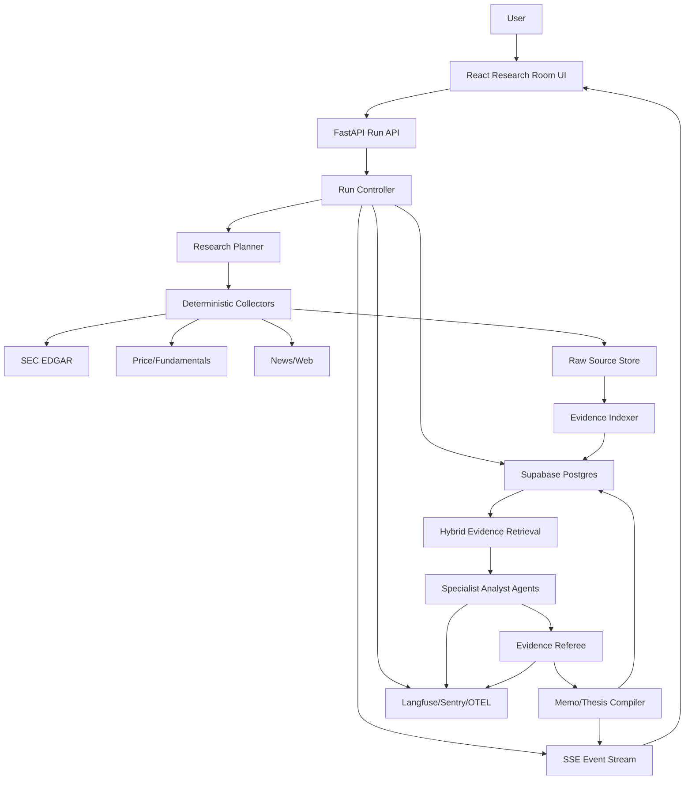

# StockSense 2026 Tech Stack And Production Architecture

Date: 2026-04-28
Decision owner: StockSense product and engineering

## Executive Decision

Do not rewrite the app.

The current stack is already pointed in the right direction:

- React/Vite frontend with streaming UX.
- FastAPI backend with Pydantic schemas.
- Supabase for auth, structured persistence, RLS, run history, and evidence tables.
- LangGraph already present for graph-style agent flows.
- SSE already present for real-time progress.
- Thesis-check runs, evidence hashing, run steps, corrections, and a run inspector already exist.

The right upgrade is not a new full-stack migration. The right upgrade is a production research architecture around the existing system:

1. Add a real SEC/fundamentals document and facts layer.
2. Add hybrid evidence retrieval in Supabase Postgres using full text search plus pgvector.
3. Add explicit run types and run-state orchestration.
4. Add LangGraph checkpointing only where branching/resume matters.
5. Add Langfuse for LLM/agent traces and evals once the new Research Room flow lands.
6. Defer Temporal, CrewAI, OpenAI Agents SDK migration, and external vector databases until the product has workloads that justify them.

The final product should feel like a research operating system for investment conviction, not a chatbot with finance tools.

## Research Inputs Used

Current-source checks:

- LangGraph overview and durable execution: https://docs.langchain.com/oss/python/langgraph/overview and https://docs.langchain.com/oss/python/langgraph/durable-execution
- LangChain multi-agent guidance: https://www.langchain.com/blog/how-and-when-to-build-multi-agent-systems
- Supabase pgvector and hybrid search: https://supabase.com/docs/guides/database/extensions/pgvector and https://supabase.com/docs/guides/ai/hybrid-search
- SEC EDGAR APIs: https://www.sec.gov/search-filings/edgar-application-programming-interfaces
- Langfuse observability: https://langfuse.com/docs
- Temporal Python workflows: https://docs.temporal.io/develop/python/workflows
- Firecrawl extraction and web data tooling: https://docs.firecrawl.dev/features/extract
- LlamaIndex document ingestion/retrieval: https://docs.llamaindex.ai/en/stable/
- OpenAI Agents SDK runner/durable integrations: https://openai.github.io/openai-agents-python/running_agents/

Repo surfaces checked:

- `pyproject.toml`
- `uv.lock`
- `requirements.txt`
- `requirements-backend.txt`
- `frontend/package.json`
- `architecture-flow.md`
- `stocksense/main.py`
- `stocksense/orchestration/thesis_check.py`
- `stocksense/orchestration/thesis_evidence.py`
- `stocksense/orchestration/react_flow.py`
- `supabase/migrations/007_thesis_forensics_runs.sql`
- `frontend/src/features/conviction/*`
- `docs/STOCK_RESEARCH_AGENT_IDEA.md`
- `docs/STOCKSENSE_CATEGORY_DEFINING_DIRECTION.md`

## Current Architecture Assessment

The system is not a toy anymore. It already has:

- Authenticated thesis-check streaming route.
- Persisted thesis check runs.
- Persisted run steps.
- Persisted evidence items.
- Evidence hashing for unchanged-run detection.
- User corrections.
- Partial source failure handling.
- Frontend run inspector.
- Frontend thesis workbench.
- Fast deterministic evidence collection in parallel.
- Two-call adversarial evaluator and conviction synthesizer.

The actual weak areas are:

1. Data quality: current evidence relies too much on NewsAPI, yfinance, and headline-level data.
2. Retrieval: no durable filing/document chunk store, no hybrid search, no citation-grade passage retrieval.
3. Runtime durability: the current SSE request owns too much of the run lifecycle.
4. Dependency drift: resolved by making `pyproject.toml` and `uv.lock` the Python source of truth; requirements files are compatibility exports.
5. Observability: product-visible run steps exist, but there is no dedicated LLM trace/eval platform.
6. Agent taxonomy: the product has agents, but not yet a clean distinction between deterministic collectors, LLM analysts, critics, and background monitors.

## Exact 2026 Stack

### Frontend

Keep:

- React 19.
- Vite.
- TypeScript.
- TanStack Query.
- Tailwind.
- Radix UI primitives.
- Recharts.
- SSE/fetch streaming.

Add:

- A run-event client abstraction shared by Research Room, Thesis Check, Narrative Truth Test, and Scenario Simulation.
- A lane-based progress UI: `plan`, `sources`, `evidence`, `challenge`, `memo`, `next watch`.
- A run replay UI backed by persisted run steps.
- Source health cards for SEC, price, fundamentals, news, web, transcripts.

Do not migrate to:

- Next.js, unless server-rendered marketing/content pages become a real need.
- Vercel AI SDK for core agent logic. The backend already owns finance data access, auth, run persistence, and source control. Splitting agent state into a Node edge layer would create duplicated orchestration.

### Backend

Keep:

- FastAPI.
- Pydantic v2 schemas.
- Python 3.12.
- Uvicorn.
- Supabase Python client.
- SSE via `StreamingResponse`.

Add:

- `httpx` for async external data calls in new collectors.
- `tenacity` retry wrappers around LLM and external source calls.
- A `RunController` service that creates, updates, resumes, and completes typed runs.
- A typed event envelope for all agent/product events.
- A provider boundary for LLMs: `LLMClient.invoke_structured(schema, prompt, metadata)`.

Dependency rule:

- Use `uv sync`, `uv run`, and `uv export`. `pyproject.toml` is the dependency source of truth, `uv.lock` is the reproducible lockfile, and `requirements*.txt` files are generated compatibility exports only.

### Agent Framework

Use:

- LangGraph for flows with branching, explicit state, resume, human-in-loop, or multi-step graph semantics.
- Custom deterministic Python services for collectors, persistence, validation, and run control.

Do not use:

- CrewAI as the core framework. It optimizes for role-playing teams, but StockSense needs citation discipline, typed state, and durable evidence ledgers.
- AutoGen as the core framework. It is useful for agent conversations, but StockSense is a workflow and evidence system, not a chatroom.
- A full OpenAI Agents SDK migration right now. The SDK has useful runners, handoffs, sessions, and durable integrations, but this repo already uses LangGraph/LangChain and Gemini. Migrating would spend time on framework churn instead of product depth.
- MCP as product runtime architecture. MCP is excellent for development/research tooling. The product should use internal adapters for SEC, market data, news, and storage.

### Memory And Retrieval

Use Supabase Postgres as the canonical memory system.

Add:

- `pgvector` for semantic evidence search.
- Postgres full text search via `tsvector` for exact source matching.
- Hybrid search using reciprocal ranked fusion over keyword and embedding matches.
- JSONB for run payloads, agent outputs, source metadata, validation errors, and prompt versions.
- Supabase Storage for raw filing HTML, PDFs, transcript uploads, and evidence snapshots.

Do not add Pinecone, Weaviate, or Qdrant for the first version. They add another database before there is enough retrieval scale to justify it.

Use LlamaIndex only if document ingestion becomes complex:

- Good fit: uploaded PDFs, transcript bundles, messy tables, mixed document collections.
- Not needed for MVP SEC XBRL facts, company submissions, and 10-K/10-Q filing metadata.

### Data Sources

Tier 1, build now:

- SEC EDGAR company submissions.
- SEC EDGAR company facts/XBRL.
- SEC filing archive URLs and accession metadata.
- yfinance for quick price/fundamental snapshots, clearly labeled as non-primary.
- NewsAPI as a news fallback.

Tier 2, add as product matures:

- Firecrawl for public web evidence, investor relations pages, conference pages, and non-structured sources.
- Exa for web discovery if search quality is needed.
- FMP/Finnhub/Polygon/IEX if paid market data becomes necessary.
- User-uploaded transcripts or paid transcript provider later.

### Infra

MVP:

- Frontend: Vercel.
- Backend: Cloud Run or Render, whichever is already deployed and stable.
- Database/auth/storage: Supabase.
- Background scheduling: existing APScheduler for simple monitors.
- Run-state durability: Supabase run tables.

Production upgrade:

- Add a worker process separate from the HTTP API.
- Use Redis-backed jobs only when background research can outlive a request.
- Prefer Dramatiq or RQ for the first worker queue if the workload is simple.
- Use Temporal only when workflows must run for hours/days, pause for human input, resume after deploys, or fan out into many child workflows.

Do not introduce Temporal in week one. It is a strong long-running workflow tool, but the current product can get most of the interview signal from typed run tables, resumable run state, and visible step telemetry.

### Observability And Evals

Keep:

- Product-visible run inspector.
- `thesis_check_steps`.
- Evidence hashes.
- Prompt version fields.
- Validation error fields.

Add:

- Langfuse for LLM traces, sessions, latency, cost, graph views, and eval datasets.
- Sentry for backend/frontend exceptions.
- OpenTelemetry IDs carried through API request, run ID, LLM trace, and persisted step.
- Golden set evals for citations, unsupported claims, source failure behavior, and memo quality.

Do not rely only on app logs. For agent systems, the important failures are decision failures: wrong source, wrong passage, invalid citation, unsupported claim, runaway token cost, and hidden retry loops.

## Target Product Architecture

## Run Types

Every major user action should create a typed run:

1. `RESEARCH_ROOM`
   - User asks a ticker/question.
   - Output: evidence-backed memo, narrative verdict, contradiction cards, draft thesis.

2. `THESIS_CHECK`
   - User checks an existing thesis.
   - Output: conviction diff and claim-level evidence.

3. `NARRATIVE_TEST`
   - User asks "is this market story real?"
   - Output: supported, contradicted, missing proof, next watch item.

4. `SCENARIO_SIMULATION`
   - User asks what future breaks or strengthens a thesis.
   - Output: scenario paths, claim impacts, evidence requirements.

5. `RESEARCH_BOUNTY`
   - User launches a long-running evidence search.
   - Output: curated evidence packet with referee verdict.

6. `WATCHLIST_MONITOR`
   - Background agent checks new filings/news/metrics against saved observables.
   - Output: alerts and "changed since last run" cards.

## Agent Architecture

### Deterministic Services

These are not LLM agents:

- `RunController`: creates run records, emits events, manages state transitions.
- `SourceCollector`: fetches SEC, price, fundamentals, news, and web data.
- `EvidenceIndexer`: chunks documents, hashes evidence, stores source metadata.
- `MemoryRetriever`: retrieves thesis history, corrections, prior runs, and source history.
- `Validator`: rejects malformed outputs, invalid evidence refs, and uncited claims.
- `CostController`: enforces token/source/runtime budgets.

### LLM Agents

Use agents where judgment is actually useful:

- `ResearchPlanner`: converts ticker/question into source plan and required evidence.
- `FilingAnalyst`: reads filings and extracts claim-relevant passages.
- `FundamentalsAnalyst`: maps thesis claims to financial metrics and trends.
- `NarrativeDecomposer`: turns vague market narratives into testable claims.
- `ContradictionAgent`: finds story-vs-number mismatches.
- `PeerAnalyst`: compares company signals against peer signals.
- `BullAnalyst`: strongest supported positive case.
- `BearAnalyst`: strongest supported negative case.
- `EvidenceReferee`: rejects unsupported or weakly cited claims.
- `MemoCompiler`: produces the final product artifact.
- `CalibrationJudge`: resolves prior forecast questions and updates user calibration.

### When To Use Multi-Agent

Use multiple agents when:

- The subtasks need different evidence or perspectives.
- They can run in parallel.
- The outputs can be independently validated.
- The product benefits from visible disagreement.

Examples:

- Filing, fundamentals, news, and peer analysis can run in parallel.
- Bull and bear cases should be separate only after evidence exists.
- Referee should be separate from writers because its job is rejection, not persuasion.

Use one agent or deterministic code when:

- The task is extraction with a fixed schema.
- The task is source fetching.
- The task is validation.
- The task needs strict reproducibility.
- The task is short enough that role fragmentation just adds latency.

## Memory System

Memory should be product-native, not just prompt context.

### Memory Layers

1. Request memory
   - Current run state, selected ticker, research question, source statuses, partial outputs.
   - Lifetime: one run.
   - Store: `research_room_runs`, `research_room_steps`, SSE state.

2. Thesis memory
   - User thesis, claims, kill criteria, forecast questions, evidence refs, corrections.
   - Lifetime: months or years.
   - Store: `theses`, `thesis_claims`, `claim_observables`, `forecast_questions`, `thesis_corrections`.

3. Evidence memory
   - SEC facts, filing chunks, news items, web evidence, transcript excerpts, source hashes.
   - Lifetime: source dependent.
   - Store: `source_documents`, `evidence_chunks`, `research_evidence_items`.

4. User calibration memory
   - Prior predictions, confidence, resolved outcomes, bias patterns.
   - Lifetime: user lifetime.
   - Store: `forecast_resolutions`, `calibration_events`, `user_research_profile`.

5. System memory
   - Prompt versions, tool health, source reliability, eval scores, failure patterns.
   - Lifetime: deployment lifetime.
   - Store: `prompt_versions`, `eval_runs`, `source_health`, Langfuse datasets.

### Retrieval Strategy

Retrieval should happen in this order:

1. Deterministic filters:
   - user ID
   - ticker
   - thesis ID
   - source type
   - filing type
   - period
   - run type

2. Exact/keyword search:
   - filing section names
   - accounting term
   - metric name
   - customer/product name
   - management quote keyword

3. Semantic search:
   - claim paraphrases
   - thesis language
   - similar prior narratives
   - related risk language

4. Rerank and validate:
   - prefer primary sources
   - prefer recent filings
   - prefer direct metric evidence
   - downrank syndicated news repeats
   - reject evidence with no source URL/hash

### Memory Update Rules

Agents should not freely write long-term memory.

Allowed automatic writes:

- source documents
- evidence chunks
- run steps
- final run outputs
- source status
- evidence hashes

Human-confirmed writes:

- thesis claim changes
- kill criteria changes
- user corrections
- forecast question edits
- calibration labels

Decay rules:

- Price/news evidence decays quickly.
- SEC facts remain durable but can be superseded by newer filings.
- User corrections should not decay.
- Calibration events should be weighted by recency but never deleted.
- Repeatedly contradicted narratives should become lower-trust suggestions.

## Orchestration And Data Flow

### Fast Interactive Flow

User clicks `Start Research`.

Under the hood:

1. Frontend creates stream request.
2. FastAPI validates ticker and auth.
3. `RunController` creates `RESEARCH_ROOM` run.
4. SSE sends `started`.
5. `ResearchPlanner` creates source plan.
6. Collectors run SEC, price, fundamentals, news, and web in parallel.
7. Each source writes source status and evidence candidates.
8. Evidence is chunked, hashed, stored, and indexed.
9. Hybrid retrieval selects compact evidence for analysts.
10. Specialist analysts run in parallel.
11. Referee validates evidence refs.
12. Memo compiler produces final artifact.
13. Final result is persisted.
14. Frontend shows memo, evidence receipts, contradiction cards, and `Draft thesis`.

Latency target:

- First UI event: under 1 second.
- First source completion: 2 to 5 seconds.
- SEC/company facts snapshot: 5 to 12 seconds.
- Full Research Room MVP: 20 to 45 seconds.
- Deep mode: 60 to 120 seconds.

### Background Flow

Use background agents for:

- watchlist monitoring
- new filing detection
- evidence refresh
- research bounties
- forecast resolution
- calibration summaries

In MVP:

- APScheduler triggers monitors.
- Run state persists in Supabase.
- Each background job has idempotency keys.
- UI can load latest run state after refresh.

In production:

- Dedicated worker service consumes jobs.
- Queue payload contains only IDs, not giant context.
- Worker loads current state from Supabase.
- Retry policy is per source and per LLM call.
- Dead-letter failed jobs with user-visible failure reason.

## Reliability Standards

### Source Failure

If SEC fails:

- Continue with cached SEC data if available.
- Mark source as failed.
- Warn that primary filing evidence is unavailable.

If news fails:

- Continue with filings, fundamentals, and price.
- Mark news as failed.

If LLM evaluation fails:

- Save evidence-only run.
- Show retrieved evidence and source status.
- Allow retry of only the failed step.

If citation validation fails:

- Retry once with a repair prompt.
- If still invalid, discard the claim or mark as unsupported.

### Cost Control

Rules:

- Never send full filings to an LLM.
- Retrieve top evidence chunks first.
- Use deterministic XBRL extraction for numeric facts.
- Use compact analyst-specific context.
- Cache source documents and evidence hashes.
- Skip LLM calls when evidence hash and thesis hash are unchanged.
- Use smaller models for extraction and larger models only for synthesis/referee tasks.

### Observability

Every run step should record:

- run ID
- user ID
- ticker
- run type
- step name
- status
- latency
- source/tool
- model
- prompt version
- input/output token estimate
- retry count
- validation errors
- source hashes
- evidence refs

Langfuse should receive:

- LLM spans
- retrieval spans
- prompt versions
- model names
- token/cost metrics
- final output scores
- evaluator results

Product UI should expose:

- run status
- source health
- evidence count
- cache hit
- latency by step
- invalid citation repairs
- final evidence receipts

## Build Strategy

### 2-3 Week Core

Fully build:

1. `RESEARCH_ROOM` run type.
2. `/api/research-room/{ticker}/stream`.
3. SEC submissions/company facts collector.
4. Source document/evidence tables.
5. Evidence chunk hashing.
6. Postgres full text search.
7. Optional pgvector migration if Supabase project supports it cleanly.
8. Research Planner, Filing Analyst, Fundamentals Analyst, Contradiction Agent, Evidence Referee, Memo Compiler.
9. Research Room frontend lanes.
10. `Draft thesis` handoff into existing thesis system.
11. Citation validation tests.
12. Golden demo ticker data for one or two stocks.

Fake or seed:

- Historical backtesting.
- Paid transcripts.
- Full peer universe.
- Calibration over many months.
- Deep scenario simulator.
- Long-running research bounties.

Defer:

- Temporal.
- External vector DB.
- Full LlamaIndex ingestion pipeline.
- Paid market data.
- Autonomous portfolio/trading features.
- OpenAI Agents SDK migration.

### Maximum Interview Signal

Demo this:

1. User enters: `AMD - is the AI server narrative actually proven?`
2. Research Room opens lanes and streams source collection.
3. SEC evidence appears before generic news.
4. The system tests the narrative:
   - supported
   - contradicted
   - missing proof
   - next metric to watch
5. User opens an evidence receipt with accession/source metadata.
6. User clicks `Draft thesis`.
7. The thesis becomes monitorable with claims and kill criteria.
8. Run inspector shows step telemetry, evidence hashes, prompt versions, and validation repairs.

This shows product quality, agent design, evidence discipline, stateful memory, UX, and production thinking in one flow.

## Final Stack Decision

Use this as the official build stack:

- Frontend: React 19, Vite, TypeScript, TanStack Query, Tailwind, Radix, Recharts.
- Realtime UX: SSE with resumable persisted run state.
- Backend: FastAPI, Python 3.12, Pydantic v2, `httpx`, `tenacity`, structured LLM provider boundary.
- Agent orchestration: LangGraph for graph/durable flows, custom deterministic run controller for product state.
- Memory/data: Supabase Postgres, RLS, JSONB, full text search, pgvector, Supabase Storage.
- Data sources: SEC EDGAR first, yfinance for MVP price snapshots, NewsAPI fallback, Firecrawl for web evidence where useful.
- Observability: existing run inspector plus Langfuse, Sentry, and trace IDs through every run.
- Background: APScheduler and persisted run tables now; worker queue next; Temporal only when workflows genuinely become long-running.

The stack is not the product. The product is evidence-backed conviction intelligence. The stack above gives it enough production depth without drowning the solo build in infrastructure theater.
