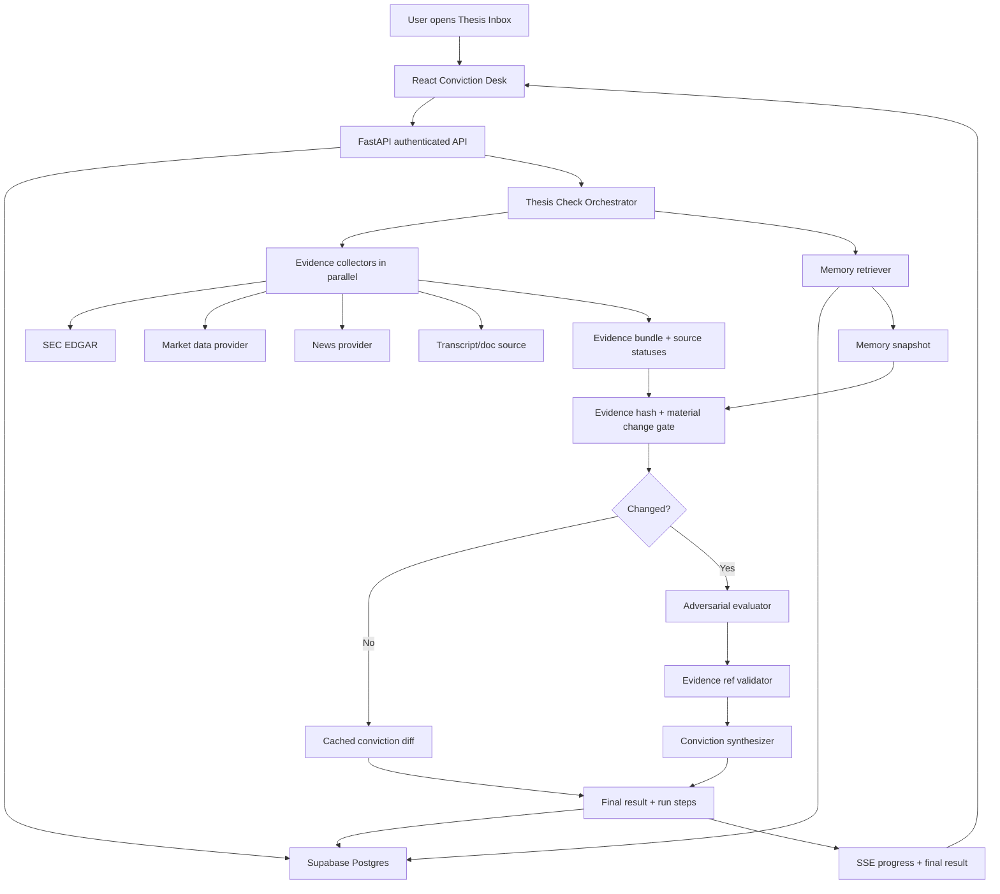

# StockSense Product Evolution Spec

Date: 2026-04-28
Branch observed: `codex/conviction-desk-fast-thesis-check`
Target product: StockSense Conviction Desk

## Executive Decision

StockSense should stop presenting itself as an "AI stock analysis agent" and become a thesis operating system for self-directed investors, prosumer investors, and early analyst-style users.

The product is not "ask about a ticker." The product is "write down what you believe, let the system continuously attack it with fresh evidence, and see exactly what strengthened, weakened, broke, or remains unsupported."

This is the strongest direction because the current repo already contains the hard product wedge:

- saved investment theses and kill criteria
- deterministic evidence collection
- memory snapshots
- adversarial evaluation
- conviction synthesis
- persisted run steps
- evidence receipts
- source health
- correction memory
- alert queue
- run inspector

The next evolution should make this feel like a real desk a user returns to every morning, not a one-off analysis demo.

Strategic extension: `docs/STOCKSENSE_CATEGORY_DEFINING_DIRECTION.md` pushes this further into the bolder product category: a Conviction World Model that turns each thesis into a causal, forecastable, backtestable belief system.

## Research Grounding

The research direction is consistent across current agent engineering and finance AI products:

- Anthropic's agent guidance argues for simple, composable workflows first, only adding autonomy when complexity demonstrably improves outcomes. It also names parallelization, orchestrator-worker, and evaluator-optimizer as distinct patterns, not one generic "agent swarm." Source: https://www.anthropic.com/engineering/building-effective-agents
- LangGraph durable execution emphasizes checkpointing, human-in-the-loop resume, idempotency keys, and avoiding repeated side effects. Source: https://docs.langchain.com/oss/python/langgraph/durable-execution
- Temporal is the heavier durable execution layer for workflows that must survive crashes, network failure, or long waits. Source: https://docs.temporal.io/
- HumanLayer's 12 Factor Agents argues for owning prompts, context windows, control flow, structured outputs, launch/pause/resume APIs, and small focused agents. Source: https://www.humanlayer.dev/blog/12-factor-agents
- MCP's core split is tools, resources, and prompts; it is valuable as a research and integration surface, but not necessarily as a product runtime dependency. Source: https://modelcontextprotocol.io/docs/learn/server-concepts
- FinRetrieval 2026 shows financial agents perform far better with structured data APIs than web search alone; tool/data availability dominated performance in their benchmark. Source: https://arxiv.org/abs/2603.04403
- SEC EDGAR APIs expose free, no-key company submissions and XBRL facts, updated throughout the day, making them the highest-leverage source upgrade for StockSense. Source: https://www.sec.gov/search-filings/edgar-application-programming-interfaces
- AlphaSense's 2026 AI-led expert calls and Hebbia's Matrix redesign show where serious finance AI is going: structured workflows, workspace-based research, citations, and multi-agent work only when tasks truly fan out. Sources: https://help.alpha-sense.com/hc/en-us/articles/49288197594515-AI-Led-Expert-Calls and https://www.hebbia.com/blog/divide-and-conquer-hebbias-multi-agent-redesign
- Langfuse and similar tools show that agent products need traces that capture LLM calls, retrieval, tool executions, timing, inputs, outputs, and metadata. Source: https://langfuse.com/docs/observability/overview

MCP research via Firecrawl also surfaced four implementation themes worth preserving:

- Layered memory should separate working memory, conversation memory, task artifacts, and long-term user preferences instead of pushing everything into one vector store.
- Trajectory-based evaluation matters more than final-answer-only grading for agents; failures often happen in source selection, tool use, or intermediate reasoning.
- Production traces should become future eval cases when users mark an answer wrong.
- Multi-agent systems need explicit budget and cost guardrails because parallel agent runs can multiply token usage quickly.

Representative sources surfaced by the MCP research pass: https://mem0.ai/blog/state-of-ai-agent-memory-2026, https://latitude.so/blog/best-ai-agent-evaluation-platforms-2026-comprehensive-comparison, https://www.braintrust.dev/articles/langsmith-alternatives-2026, https://laminar.sh/article/2026-04-23-top-6-agent-observability-platforms

## Product Definition

### What We Are Building

StockSense Conviction Desk is a persistent investment-thesis workbench.

Users create or import a thesis for a company, sector, ETF, or watchlist idea. StockSense decomposes that thesis into claims and kill criteria, monitors evidence over time, and returns a conviction diff whenever new evidence appears.

The core artifact is not a stock report. The core artifact is a living belief record.

### Target User

Primary user:

- self-directed investor with 5-30 high-interest positions or watchlist names
- comfortable reading earnings, filings, and investor commentary
- not an institutional analyst with Bloomberg/AlphaSense budget
- tired of one-shot AI summaries that do not remember prior reasoning

Secondary user:

- student, founder, or engineer interviewing for AI/product roles who wants to show a serious agentic system
- small fund analyst or angel investor who wants a lightweight thesis monitor

### End-to-End Workflow

1. User opens StockSense in the morning.
2. The desk shows a prioritized thesis inbox: "3 theses changed, 2 need evidence, 1 has a broken kill criterion."
3. User opens a thesis, sees the original belief, current conviction, claim map, and prior run timeline.
4. User clicks `Check Thesis` or opens a background alert.
5. Evidence sources run in parallel.
6. The system shows source health, evidence receipts, and the evaluation trace.
7. The final answer is a conviction diff:
   - strengthened claims
   - weakened claims
   - broken claims
   - unsupported claims
   - next action
8. User chooses:
   - keep monitoring
   - revise thesis
   - mark evidence irrelevant
   - request better evidence
   - run deep review
   - export memo
9. Corrections are saved and influence later runs.

### Product Feel

The product should feel like an analyst desk:

- dense, fast, evidence-first
- no marketing landing page
- no generic chat-first interface
- explicit source confidence
- visible agent progress
- transparent failures
- calm but serious UI
- every conclusion tied to a receipt

Addictiveness comes from the morning loop: the user returns because the system tells them what changed about their own beliefs, not because it generates generic market commentary.

## Current System Assessment

### Strong Existing Pieces

- `stocksense/orchestration/thesis_check.py` already provides a fast, persisted thesis-check stream.
- `stocksense/orchestration/thesis_evidence.py` already collects deterministic evidence in parallel.
- `stocksense/orchestration/thesis_memory.py` retrieves prior runs, history, alerts, cached analysis, and corrections.
- `stocksense/orchestration/thesis_agents.py` uses structured outputs, evidence-reference validation, and one repair attempt.
- `stocksense/db/thesis_forensics.py` persists runs, steps, evidence, final results, and corrections.
- `frontend/src/features/conviction/*` already implements Thesis Desk, Research Intake, Alerts, Evidence Receipts, Source Health, and Run Inspector.
- `tests/evals/golden_set.py` provides the beginning of a regression harness.

### Weak Areas To Fix

- The core thesis is still mostly a free-text summary. It should become a claim graph.
- Evidence sources are too thin: news, price, and basic yfinance fundamentals are not enough for serious finance research.
- Background monitoring exists, but it is not yet a polished morning workflow.
- Deep multi-agent mode should be optional, scoped, and evidence-first.
- Run observability exists locally in tables, but not yet as a complete eval/trace discipline.
- The UI has strong components, but needs a sharper product hierarchy around inbox -> thesis -> evidence -> action.

### Repositioning

Current framing:

> AI-powered autonomous stock market research.

Better framing:

> An evidence-backed conviction desk that continuously tests your investment theses.

## Feature Set

### 1. Thesis Claim Graph

What it does: Converts a thesis into discrete claims, assumptions, metrics, expected time windows, and kill criteria.

Why it matters: A thesis like "NVDA demand remains underestimated" is not directly monitorable. Claims like "data center revenue growth stays above X" and "gross margins remain above Y" are monitorable.

UX: On save, user sees editable claim chips: `Demand`, `Margins`, `Valuation`, `Competition`, `Regulatory`, `Catalysts`.

Agents: Thesis Decomposer turns text into structured claims. Evidence Evaluator later scores each claim independently.

Technical: Add `thesis_claims` table keyed by thesis/version. Store `claim_text`, `claim_type`, `metric_hint`, `time_horizon`, `kill_criteria`, `status`, `confidence`.

### 2. Guided Thesis Builder

What it does: Helps the user create a better thesis from research output.

Why it matters: Most users do not write falsifiable investment theses. The product should teach good thesis hygiene through the interface.

UX: After ticker research, the app proposes "core thesis", "what would prove this wrong", "what to watch next", and "unsupported assumptions."

Agents: Thesis Builder proposes draft claims and kill criteria. User edits before save.

Technical: Extend `ResearchIntake` to call a new `/api/research/{ticker}/thesis-draft` endpoint or reuse final analysis output with a structured builder call.

### 3. Evidence Receipts 2.0

What it does: Every claim-level conclusion links to specific evidence IDs, source type, reliability tier, timestamp, and source URL.

Why it matters: Trust in financial AI depends on traceability. The user should never wonder why a claim was weakened.

UX: Click a claim -> side panel shows the exact filing line, transcript excerpt, news item, price move, or fundamental metric.

Agents: Evidence Auditor validates that strengthened/weakened/broken claims cite provided evidence.

Technical: Keep current `ClaimAssessment.evidence_refs`, expand `EvidenceItem` with `source_url`, `document_id`, `excerpt_start`, `excerpt_end`, and `as_of_date`.

### 4. SEC Filing Diff Agent

What it does: Detects new 10-K, 10-Q, 8-K, and XBRL company facts, then summarizes material changes against thesis claims.

Why it matters: Official filings are higher-trust than news. FinRetrieval shows structured financial data APIs matter more than broad web search.

UX: A filing lane says: "New 10-Q found. Revenue growth claim strengthened. Margin claim weakened. No direct evidence for AI attach-rate claim."

Agents: Filing Diff Agent and Numeric Fact Extractor.

Technical: Add SEC CIK mapping, `sec_submissions`, `sec_company_facts`, and `filing_evidence_items`. Use SEC APIs first, yfinance/FMP as supplemental.

### 5. Earnings Call / Transcript Mode

What it does: Ingests earnings call transcript snippets and maps management commentary to saved thesis claims.

Why it matters: Serious investors monitor language changes, guidance, segment commentary, and Q&A tone.

UX: "Management changed language around enterprise demand from 'broad-based' to 'selective.'"

Agents: Transcript Analyst, Claim Mapper, Skeptic.

Technical: Start with user-uploaded or demo transcripts. Later integrate Quartr/Fiscal.ai/FMP transcript APIs if available.

### 6. Daily Morning Conviction Brief

What it does: Background agents summarize what changed overnight for saved theses.

Why it matters: This turns the app into a daily habit.

UX: Front page: "Today: 2 theses need review, 4 unchanged, 1 evidence gap closed."

Agents: Watchman, Brief Synthesizer, Alert Prioritizer.

Technical: Extend `scheduler.py` or create worker job. Store `daily_briefs`, `brief_items`, and `brief_source_refs`. Use existing alert queue UI as the destination.

### 7. Material Change Fast Path

What it does: If thesis hash and evidence hash match the latest completed run, skip LLM work and return a cached no-material-change result.

Why it matters: Daily use dies if every check costs 30 seconds and LLM calls.

UX: "No material change since Apr 28, 2026, 10:13 PM. Source health unchanged."

Agents: None. This is deterministic orchestration.

Technical: Current `find_latest_completed_run` and `evidence_hash` make this mostly available. Add prompt/model version to the cache key.

### 8. Deep Review Mode

What it does: Optional 60-120 second mode that fans out specialist agents when the user wants a serious review.

Why it matters: Normal mode should be fast; deep mode is the impressive agentic system.

UX: Button: `Run Deep Review`. User sees lanes for filing, fundamentals, news, price, bear case, bull case, synthesis, and audit.

Agents: Research Planner, Filing Analyst, Fundamentals Analyst, News Analyst, Market Analyst, Bull/Bear Analysts, Evidence Auditor, Synthesizer.

Technical: Use `asyncio.gather` first. Move to LangGraph with Postgres checkpointer if interruptions/resume become required.

### 9. Correction Memory Loop

What it does: User corrections become durable memory: irrelevant source, weak evidence, bad claim mapping, wrong metric, missing source.

Why it matters: The system improves in the user's language over time.

UX: Buttons already exist: `Mark irrelevant`, `Needs better evidence`. Add "why?" inline and show "used in next run."

Agents: Memory Curator normalizes corrections into future prompt context.

Technical: Extend `thesis_corrections` with `correction_scope`, `normalized_rule`, `applied_at_run_id`, and `resolved`.

### 10. Source Health Ledger

What it does: Shows source freshness, reliability, latency, and failures per run.

Why it matters: Missing evidence is not bearish evidence. Users need to know when the system is blind.

UX: Source strip: SEC ok, price ok, news timeout, transcript missing.

Agents: None for collection. Evidence Auditor can flag insufficient source coverage.

Technical: Current `SourceStatus` is good. Add stale/coverage semantics and store source-specific as-of timestamps.

### 11. Run Replay and Inspector

What it does: Lets user or interviewer inspect every run step, prompt version, retry, validation error, evidence hash, and latency.

Why it matters: This is the CTO-impressing infrastructure surface.

UX: Existing `RunInspector` becomes a first-class collapsible trace panel with "copy debug bundle."

Agents: None.

Technical: Expand `thesis_check_steps` and optionally instrument Langfuse/OpenTelemetry spans.

### 12. Conviction Timeline

What it does: Shows how conviction changed across runs.

Why it matters: The product is about belief evolution.

UX: Timeline with verdict badges: hold -> monitor -> revise -> invalidate, with top reason for each change.

Agents: Timeline Summarizer optionally creates period summaries.

Technical: Use `thesis_check_runs` and `thesis_history`; add lightweight chart component.

### 13. Scenario Board

What it does: Maintains bull/base/bear scenarios and key drivers for each thesis.

Why it matters: Investors think in scenarios, not single-point recommendations.

UX: Three columns: "What must happen", "Current evidence", "Probability movement."

Agents: Scenario Synthesizer.

Technical: Add `thesis_scenarios` and link claims/evidence to scenario drivers.

### 14. Portfolio Thesis Inbox

What it does: Prioritizes all saved theses by urgency, evidence changes, broken criteria, and source confidence.

Why it matters: Users do not want to click every ticker.

UX: Default view becomes an inbox: `Review now`, `Monitor`, `No change`, `Needs evidence`.

Agents: Alert Prioritizer.

Technical: Compute a `review_priority_score` from run status, freshness, verdict, alert count, and source failures.

### 15. Exportable Memo

What it does: Exports a thesis check into a clean memo with claims, evidence, verdict, and next actions.

Why it matters: It makes the product shareable and interview/demo-friendly.

UX: `Export memo` button on final result.

Agents: Memo Writer.

Technical: Markdown first, PDF later. Use persisted evidence and final result, not a fresh LLM call unless polishing.

### 16. Agent Eval Suite

What it does: Tests claim grounding, evidence refs, source-failure behavior, prompt regressions, and financial retrieval accuracy.

Why it matters: This separates a serious system from a demo.

UX: Not user-facing except a demo "evals passed" badge in docs.

Agents: Eval Judge for offline grading.

Technical: Expand `tests/evals/golden_set.py`; add cases for SEC facts, unsupported claims, no-evidence runs, stale data, and correction memory.

## Agent System Expansion

### Normal Mode

Normal mode should stay collapsed and fast:

1. Thesis Decomposer
   - Runs on create/edit, not every check.
   - Outputs claim graph and kill criteria.

2. Evidence Collector
   - Deterministic async collectors.
   - Sources: SEC, price, fundamentals, news, cached analysis, transcripts when available.
   - Not an LLM agent.

3. Memory Retriever
   - Deterministic lookup of thesis versions, prior runs, corrections, alerts, and origin snapshot.
   - Not an LLM agent.

4. Adversarial Evaluator
   - One structured LLM call.
   - Challenges claims against evidence only.

5. Conviction Synthesizer
   - One structured LLM call.
   - Produces verdict, claim diff, next actions.

6. Evidence Auditor
   - Deterministic validation plus optional LLM judge offline.
   - Blocks unsupported claims from sounding grounded.

### Deep Mode

Deep mode justifies multi-agent fan-out:

1. Research Planner
   - Decides which specialist agents are needed.
   - Does not fetch data itself.

2. Filing Analyst
   - Reads SEC filing changes and XBRL facts.

3. Fundamentals Analyst
   - Reviews financial statements, ratios, margins, cash flow, valuation.

4. Transcript Analyst
   - Maps earnings commentary to claims.

5. Market/Technicals Analyst
   - Reviews price movement, volume, relative performance, volatility.

6. News/Event Analyst
   - Reviews high-relevance external events.

7. Bull Case Builder
   - Builds the strongest support case using cited evidence.

8. Bear Case Builder
   - Builds the strongest opposition case using cited evidence.

9. Evidence Referee
   - Rejects uncited or weakly grounded claims.

10. Synthesis Editor
   - Produces the final memo, scenario board, and next actions.

### Background Agents

1. Watchman
   - Scheduled or event-driven.
   - Detects new evidence and broken kill criteria.

2. Morning Brief Agent
   - Produces daily user-facing brief.

3. Correction Curator
   - Converts user corrections into durable memory rules.

4. Catalyst Calendar Agent
   - Tracks earnings, filings, investor days, macro dates, and scheduled thesis reviews.

### Remove or Downgrade

- Bull/Bear/Skeptic should not be mandatory on the normal hot path.
- The old ticker ReAct loop should become Research Intake, not the product center.
- Debate Lab should remain a showcase or deep-mode path, not the default workflow.

## End-to-End UX

### Entry Point

The first screen should be `Thesis Inbox`, not a generic search page.

User sees:

- Review now
- Recent conviction changes
- Source failures
- Upcoming catalysts
- Create thesis
- Import/watch ticker

### Create Thesis Flow

1. User clicks `Create Thesis`.
2. Enters ticker and rough thesis.
3. Clicks `Draft claim graph`.
4. System returns:
   - core thesis
   - 3-7 claims
   - kill criteria
   - evidence needed
   - catalyst dates
5. User edits and saves.

### Daily Check Flow

1. User opens thesis.
2. Clicks `Check Thesis`.
3. UI shows lanes:
   - Evidence
   - Memory
   - Challenge
   - Conviction
4. Each lane streams status.
5. Final result appears as:
   - verdict badge
   - one-line summary
   - claim diff grid
   - evidence receipts
   - next actions
6. User acts.

### Alert Flow

1. Background watchman finds a broken or weakened claim.
2. Alert appears in inbox.
3. User opens alert.
4. Evidence receipt is already attached.
5. User acknowledges, revises, dismisses, or deep reviews.

### Deep Review Flow

1. User chooses a claim or thesis.
2. Clicks `Run Deep Review`.
3. A run monitor shows specialist lanes.
4. User can stop, recover latest, or steer by adding a note.
5. Final output is a memo plus claim-level receipts.

### Error Handling

- News fails: continue and label source partial.
- Fundamentals fail: continue with filings, price, and memory.
- SEC fails: show high-severity source gap.
- LLM eval fails: persist evidence-only result.
- Synthesis fails: show challenge output and mark final unavailable.
- Validation fails: repair once, then persist partial.
- Browser disconnects: recover latest run from persisted run state.

## Technical Architecture

## Feature-To-Implementation Map

| Feature | Backend | Agents | Data Flow | Frontend |
|---|---|---|---|---|
| Claim Graph | `thesis_claims`, decomposer endpoint | Thesis Decomposer | thesis text -> claims -> save | editable claim chips |
| Evidence Receipts | extend `EvidenceItem` | Evidence Auditor | evidence -> refs -> validation | claim receipt drawer |
| SEC Diff | SEC adapter + CIK mapping | Filing Analyst | SEC submissions/facts -> evidence | filing lane |
| Morning Brief | scheduled job + `daily_briefs` | Watchman, Brief Synthesizer | prior runs + new evidence -> brief | inbox cards |
| Deep Review | async fan-out orchestration | specialist agents | claim -> specialist outputs -> audit -> memo | lane monitor |
| Correction Memory | extend `thesis_corrections` | Correction Curator | user correction -> normalized rule -> future context | correction controls |
| Run Inspector | expand run step metadata | none | steps -> trace table | trace panel |
| Eval Suite | golden set + judge scripts | Eval Judge offline | fixture -> run -> score | docs badge only |

## Tech Stack Recommendation

### Keep

- FastAPI, Pydantic, asyncio
- React 19, Vite, TypeScript, TanStack Query, Tailwind
- Supabase Postgres and RLS
- SSE for normal streaming
- Existing structured-output LLM calls

### Add First

- SEC EDGAR adapter
- claim graph tables
- source freshness metadata
- prompt/model version in cache key
- Langfuse or LangSmith tracing in dev/prod
- OpenTelemetry-compatible span IDs in run steps
- richer eval golden set

### Add Later

- Redis event buffer if SSE reconnect replay becomes painful
- LangGraph Postgres checkpointer for deep-mode resume, branching, and human-in-loop interruptions
- Temporal only when workflows become long-running across hours/days, require durable schedules/signals, or run outside the HTTP request lifecycle
- paid data source fallback such as FMP, Polygon, Fiscal.ai, Quartr, or OpenBB integrations

### Avoid For Now

- MCP inside runtime product architecture unless there is a specific third-party integration need
- autonomous trading
- generic chat as primary UX
- always-on multi-agent debate for every check
- building a Bloomberg clone

## System Evolution Plan

### Phase 1: Make Current Product Coherent

Goal: Thesis-first, receipts-first product.

Build:

- Thesis Inbox as default screen
- claim graph on thesis create/edit
- SEC filing evidence source
- material change fast path with model/prompt version
- improved source health and stale-data labels
- conviction timeline

### Phase 2: Make It Habitual

Goal: User returns daily.

Build:

- morning brief
- better alert prioritization
- catalyst calendar
- background watchman UX
- correction memory visible in future runs

### Phase 3: Make It CTO-Impressive

Goal: Show serious agent infrastructure.

Build:

- Deep Review Mode
- specialist agent fan-out
- run replay
- tracing integration
- eval suite with pass/fail report
- exportable memo

### Phase 4: Make It Product-Grade

Goal: Reduce demo fragility and increase trust.

Build:

- provider fallback chain
- persistent event replay
- document uploads
- transcript ingestion
- richer portfolio import
- deployment runbook and monitoring

## 2-3 Week Solo Execution Reality

### Week 1

- Implement claim graph schema and UI.
- Add SEC submissions/companyfacts adapter.
- Add SEC evidence lane.
- Improve cache key with thesis/evidence/prompt/model versions.
- Polish Thesis Inbox default view.

### Week 2

- Build morning brief and background alert polish.
- Build conviction timeline.
- Extend correction memory.
- Add export memo markdown.
- Add source freshness warnings.

### Week 3

- Add Deep Review Mode lite with 4 agents:
  - Filing Analyst
  - Fundamentals Analyst
  - Bear Case Builder
  - Synthesizer
- Add run replay/trace polish.
- Expand eval harness.
- Prepare demo fixtures and seeded data.

### Build Fully

- claim graph
- SEC evidence adapter
- evidence receipts
- source health
- run inspector
- material-change cache
- correction memory
- export memo

### Fake or Seed For Demo

- brokerage import
- paid transcript API
- real-time Polygon feed
- AlphaSense-style expert interviews
- full Temporal background infrastructure
- PDF export if markdown memo is enough

### Maximum Impact Per Effort

1. Claim graph
2. SEC evidence
3. Thesis Inbox
4. Morning brief
5. Deep Review lite
6. Better trace/replay

## Killer Demo

### Scenario

Use an NVDA thesis:

> "NVDA remains under-owned because inference demand is underestimated, data center growth will stay above expectations, and gross margins will hold above 70 percent despite Blackwell ramp costs."

### Demo Steps

1. Open Thesis Inbox.
   - Show NVDA flagged: "margin claim needs review."

2. Open thesis.
   - Show claim graph:
     - inference demand underestimated
     - data center growth above expectations
     - gross margin above 70 percent
     - export controls manageable

3. Click `Check Thesis`.
   - Evidence and memory lanes stream.
   - SEC/source health visible.

4. Show conviction diff.
   - Strengthened: data center demand evidence.
   - Weakened: margin pressure or export restrictions.
   - Unsupported: under-owned/inference adoption claim needs better evidence.

5. Open evidence receipt.
   - Show exact evidence IDs and source health.

6. Mark one evidence item irrelevant.
   - Correction saved.

7. Rerun or show next-run memory.
   - Correction appears in memory snapshot.

8. Open Run Inspector.
   - Show run steps, latency, prompt version, retry count, evidence hash, validation status.

9. Run Deep Review lite.
   - Show specialist lanes and final memo.

### What Impresses

- Product quality: it solves a real repeated workflow, not a one-shot chat.
- Agent design: normal mode is collapsed for latency; deep mode uses agents only where fan-out helps.
- Engineering depth: persisted runs, evidence hashes, source health, validation repair, run inspector.
- Trust: every claim has receipts and unsupported claims are not hidden.
- UX judgment: user actions are review, revise, monitor, export, and correct.

## Product Principle

Every new feature must answer three questions:

1. Which belief, claim, or decision does this help the user update?
2. What evidence does it use, and how does the user inspect that evidence?
3. Does this need an agent, or should deterministic code do it?

If a feature cannot answer those questions, it does not belong in Conviction Desk.
