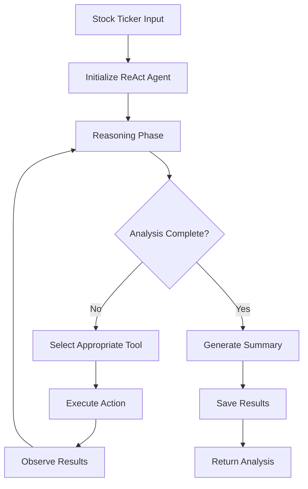

# StockSense Agent

**AI-Powered Autonomous Stock Market Research (ReAct Pattern)**

StockSense is an autonomous stock analysis system implementing the **ReAct (Reasoning + Action)** pattern: iterative reasoning, selective tool invocation, and adaptive summarization. The agent collects real market data (news + historical prices), performs LLM-based sentiment analysis, and produces a structured summary.

[](https://www.python.org/downloads/)
[](https://fastapi.tiangolo.com/)
[](https://react.dev/)
[](https://langchain-ai.github.io/langgraph/)
[](https://python.langchain.com/)
[](LICENSE)

## Overview

StockSense demonstrates an applied AI agent architecture using LangGraph + LangChain tools. It combines recent news headlines (NewsAPI) and historical market data (Yahoo Finance via yfinance) with Gemini-based sentiment analysis (Gemini 2.0 Flash Lite) to produce a lightweight research snapshot. The agent maintains internal state (messages, tool usage, reasoning steps) across iterations until completion criteria are met or a max-iteration limit is reached.

### Key Characteristics

- **ReAct Agent**: Iterative reasoning cycle with tool calls (news, price data, sentiment, persistence)
- **Backend API**: FastAPI service exposing analysis endpoints and cached result retrieval
- **Frontend App**: React + TypeScript modern dashboard with thesis tracking
- **LLM Integration**: Google Gemini 2.0 Flash Lite (chat + text variants) via `langchain-google-genai`
- **Stateful Orchestration**: LangGraph `StateGraph` with conditional continuation
- **User Belief System**: Investment thesis tracking with Supabase authentication

## Architecture

### Technology Stack

| Layer            | Technology                               | Purpose                             |
| ---------------- | ---------------------------------------- | ----------------------------------- |
| **LLM / AI**     | Google Gemini 2.0 Flash Lite (LangChain) | Sentiment & reasoning               |
| **Agent Graph**  | LangGraph (StateGraph)                   | Iterative reasoning & tool routing  |
| **Tool Layer**   | LangChain `@tool` functions              | News, price, sentiment, persistence |
| **Backend**      | FastAPI + Uvicorn                        | REST API (analysis, cache, health)  |
| **Frontend**     | React + TypeScript + Vite                | Modern interactive dashboard        |
| **Persistence**  | Supabase (PostgreSQL)                    | Analysis cache + User data          |
| **Data Sources** | NewsAPI + yfinance (Yahoo Finance data)  | Headlines + OHLCV price history     |
| **Config / Env** | `python-dotenv`                          | API key management                  |

### ReAct Agent Workflow



### Core Components

```
StockSense-Agent/
├── frontend/                # React + TypeScript frontend
│   ├── src/
│   │   ├── components/      # UI components (ResultsTabs, DebateView, etc.)
│   │   ├── hooks/           # Custom hooks (useStreamingDebate, useStreamingAnalysis)
│   │   ├── pages/           # Page components (ThesesPage)
│   │   ├── api/             # API hooks and clients
│   │   ├── context/         # React contexts (Auth, Sidebar, Theme)
│   │   └── types/           # TypeScript type definitions
│   └── package.json
├── stocksense/              # Python backend (modular architecture)
│   ├── main.py              # FastAPI server (slim entry point)
│   ├── scheduler.py         # APScheduler background jobs
│   ├── agents/              # 🧠 Adversarial agent system
│   │   ├── base_agent.py    # AgentToolConfig + Information Asymmetry
│   │   ├── bull_analyst.py  # Growth-focused analyst
│   │   ├── bear_analyst.py  # Risk-focused analyst
│   │   ├── synthesizer.py   # Impartial judge + Evidence Grader
│   │   └── skeptic_agent.py # Contrarian skeptic analysis
│   ├── core/                # 🔧 Data & validation utilities
│   │   ├── data_collectors.py  # NewsAPI + yfinance helpers
│   │   ├── analyzer.py      # Sentiment analysis (Gemini)
│   │   ├── validation.py    # Ticker validation
│   │   ├── config.py        # LLM/Chat factories
│   │   ├── schemas.py       # Pydantic schemas
│   │   └── monitor.py       # Kill criteria monitoring
│   ├── db/                  # 💾 Database layer (Supabase)
│   │   ├── models.py        # Schema documentation
│   │   ├── database.py      # Supabase analysis cache
│   │   └── supabase_client.py  # Supabase user data
│   ├── api/                 # 🌐 API routes
│   │   └── auth_routes.py   # User auth, theses, kill alerts
│   └── orchestration/       # 🎭 Flow control
│       ├── react_flow.py    # ReAct + debate orchestration
│       └── streaming.py     # SSE streaming generators
├── supabase/
│   ├── schema.sql           # Database schema for user data
│   └── migrations/          # Database migrations
├── tests/
│   ├── test_api.py          # API integration tests
│   ├── test_tools.py        # Tool logic tests
│   └── test_scheduler.py    # Background job tests
├── requirements.txt         # Backend dependencies
└── requirements-backend.txt # Pin-locked backend dependencies
```

## Features

### Autonomous Agent

- Iterative reasoning loop via LangGraph (agent → tools → agent)
- Dynamic tool usage: news, price data, sentiment analysis, skeptic critique, save
- Prevents redundant tool calls (checks existing state)
- Max iteration guard (default 8)

### Market Data & Sentiment

- Recent headline aggregation (NewsAPI)
- Historical OHLCV price retrieval (yfinance)
- Per-headline sentiment analysis + overall summary (Gemini 2.0 Flash Lite)
- Skeptic analysis providing contrarian views and bear cases

### User Belief System

- User authentication via Supabase
- Investment thesis creation and tracking
- Kill criteria definition
- Thesis history and evolution tracking

### Infrastructure

- FastAPI backend (analysis trigger, cached retrieval, health, auth)
- React frontend (interactive dashboard, thesis management, debate visualization)
- Supabase PostgreSQL for all persistent storage
- Server-Sent Events (SSE) for real-time streaming

### Adversarial Debate System (Phase 3)

- **Bull Analyst**: Growth-focused agent prioritizing revenue, market expansion, forward P/E
- **Bear Analyst**: Risk-focused agent prioritizing debt ratios, margins, valuation multiples
- **Synthesizer**: Impartial judge using Evidence Grader protocol
- **Information Asymmetry**: Agents receive same data but with different priority ordering
- **Rebuttal Round**: Anti-sycophancy mechanism where agents critique each other
- **Probability-Weighted Verdict**: Bull/Base/Bear scenario probabilities

## Quick Start

### Prerequisites

- Python 3.10+
- Node.js 18+ (for frontend)
- [Google Gemini API Key](https://aistudio.google.com/app/apikey)
- [NewsAPI Key](https://newsapi.org/register)
- [Supabase Project](https://supabase.com/) (required for all features)

### Installation

```bash
git clone https://github.com/Spkap/StockSense-Agent.git
cd StockSense-Agent

# Backend setup
python -m venv venv
source venv/bin/activate  # On Windows: venv\Scripts\activate
pip install -r requirements-backend.txt

# Frontend setup
cd frontend
npm install  # or pnpm install
cd ..

# Environment variables
cat > .env << EOF
GOOGLE_API_KEY=your_google_api_key
NEWSAPI_KEY=your_newsapi_key
SUPABASE_URL=your_supabase_url
SUPABASE_ANON_KEY=your_supabase_anon_key
SUPABASE_SERVICE_KEY=your_supabase_service_key
EOF

# Apply Supabase migrations (run in Supabase SQL Editor)
# - supabase/schema.sql
# - supabase/migrations/003_analysis_cache.sql
```

### Running the Application

```bash
# Terminal 1 – Backend API
python -m stocksense.main  # http://127.0.0.1:8000

# Terminal 2 – Frontend
cd frontend
npm run dev  # http://localhost:5173
```

### REST API

```bash
# Trigger ReAct agent analysis
curl -X POST "http://localhost:8000/analyze/AAPL"

# Retrieve cached results
curl "http://localhost:8000/results/AAPL"

# System health check
curl "http://localhost:8000/health"

# Get all cached tickers
curl "http://localhost:8000/cached-tickers"
```

### Example Analysis Output

```json
{
  "ticker": "AAPL",
  "summary": "Apple Inc. demonstrates strong market sentiment...",
  "sentiment_report": "Overall Sentiment: Positive ...",
  "headlines_count": 18,
  "overall_sentiment": "Bullish",
  "overall_confidence": 0.78,
  "key_themes": [...],
  "skeptic_report": "While sentiment is positive, consider...",
  "reasoning_steps": [...],
  "tools_used": ["fetch_news_headlines", "fetch_price_data", "analyze_sentiment", "generate_skeptic_critique"],
  "iterations": 4,
  "agent_type": "ReAct"
}
```

## API Reference

### Analysis Endpoints

| Method | Path                           | Description                                           |
| ------ | ------------------------------ | ----------------------------------------------------- |
| POST   | `/analyze/{ticker}`            | Run ReAct agent analysis (fresh or cached)            |
| GET    | `/analyze/{ticker}/stream`     | SSE stream of analysis progress                       |
| GET    | `/analyze/debate/{ticker}`     | Run adversarial Bull/Bear debate analysis             |
| GET    | `/analyze/debate/{ticker}/stream` | SSE stream of debate progress                      |
| GET    | `/results/{ticker}`            | Latest cached summary & sentiment                     |
| DELETE | `/results/{ticker}`            | Delete cached analysis                                |
| GET    | `/cached-tickers`              | List all cached tickers                               |

### System Endpoints

| Method | Path      | Description                                           |
| ------ | --------- | ----------------------------------------------------- |
| GET    | `/health` | Health check with dependency status                   |
| GET    | `/`       | Root endpoint with API info                           |
| GET    | `/docs`   | Swagger UI (OpenAPI)                                  |

### User Endpoints (Auth Required)

| Method | Path                          | Description                                      |
| ------ | ----------------------------- | ------------------------------------------------ |
| GET    | `/api/me`                     | Current user profile                             |
| GET    | `/api/positions`              | User's portfolio positions                       |
| POST   | `/api/positions`              | Add portfolio position                           |
| DELETE | `/api/positions/{id}`         | Remove position                                  |
| GET    | `/api/theses`                 | User's investment theses                         |
| POST   | `/api/theses`                 | Create investment thesis                         |
| PATCH  | `/api/theses/{id}`            | Update thesis                                    |
| GET    | `/api/theses/{id}/history`    | Thesis revision history                          |
| GET    | `/api/theses/{id}/compare`    | Compare thesis to current analysis               |
| GET    | `/api/kill-alerts`            | User's kill criteria alerts                      |
| GET    | `/api/kill-alerts/{id}`       | Get specific alert                               |
| PATCH  | `/api/kill-alerts/{id}`       | Update alert status                              |
| DELETE | `/api/kill-alerts/{id}`       | Delete alert                                     |

## Testing

```bash
# All tests (requires backend deps installed)
pytest -v

# Individual modules
pytest tests/test_api.py -v
pytest tests/test_tools.py -v

# Optional coverage
pytest --cov=stocksense --cov-report=term-missing
```

## Deployment

### Backend (Render)

Deploy the FastAPI backend to Render using the `render.yaml` configuration.

### Frontend (Vercel/Netlify)

The React frontend can be deployed to any static hosting service:

```bash
cd frontend
npm run build  # Produces dist/ folder
```

Set `VITE_API_URL` environment variable to your backend URL.

## Technical Highlights

- LangGraph workflow: agent node + tool node + conditional edge
- State tracks tools used, reasoning steps, iterations, messages
- Redundant tool invocations avoided (sentiment/news/price dedupe)
- Supabase PostgreSQL for persistent, production-ready storage
- Gemini rate limit handling produces user-friendly summary
- Epistemic honesty: confidence scores, information gaps, skeptic critique

### Disclaimer

Example outputs are illustrative; actual results depend on live NewsAPI & yfinance data plus Gemini responses.
