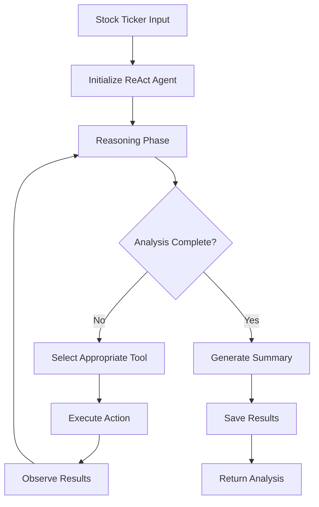

# StockSense Agent

**AI-Powered Autonomous Stock Market Research System Using Advanced ReAct Pattern**

An intelligent stock analysis platform that leverages the **ReAct (Reasoning + Action)** design pattern to conduct autonomous market research through sophisticated AI agent capabilities, dynamic tool selection, and adaptive strategy formation.

[](https://www.python.org/downloads/)
[](https://fastapi.tiangolo.com/)
[](https://streamlit.io/)
[](https://langchain-ai.github.io/langgraph/)

## Overview

StockSense demonstrates advanced AI agent architecture through autonomous reasoning, self-correction, and intelligent tool orchestration. The system combines real-time market data with AI-powered sentiment analysis to provide comprehensive stock market insights.

### Key Achievements

- **Autonomous ReAct Agent**: Self-guided analysis with dynamic tool selection and iterative reasoning
- **Production-Ready Architecture**: Full-stack application with FastAPI backend and Streamlit frontend
- **Advanced AI Integration**: Google Gemini 2.5 Flash with optimized prompting strategies
- **Enterprise-Grade Features**: Comprehensive error handling, caching, and health monitoring

## Architecture

### Technology Stack

| Layer               | Technology                          | Purpose                                    |
| ------------------- | ----------------------------------- | ------------------------------------------ |
| **AI Layer**        | Google Gemini 2.5 Flash + LangGraph | ReAct reasoning and sentiment analysis     |
| **Agent Framework** | LangChain Tools + StateGraph        | Tool orchestration and state management    |
| **Backend**         | FastAPI + Uvicorn                   | High-performance async REST API            |
| **Frontend**        | Streamlit                           | Interactive dashboard and visualizations   |
| **Database**        | SQLite + Peewee ORM                 | Persistent storage and intelligent caching |
| **Data Sources**    | NewsAPI + Yahoo Finance             | Real-time market data integration          |

### ReAct Agent Workflow



### Core Components

```
StockSense-Agent/
├── app.py                    # Streamlit frontend application
├── docker-compose.yml       # Multi-container orchestration
├── Dockerfile.backend       # Backend containerization
├── Dockerfile.frontend      # Frontend containerization
├── nasdaq_screener.csv      # Stock market data file
├── pytest.ini              # Pytest configuration
├── stocksense.db            # SQLite database file
├── stocksense/
│   ├── react_agent.py        # ReAct agent implementation (LangGraph)
│   ├── main.py              # FastAPI backend server
│   ├── data_collectors.py   # News & market data fetching
│   ├── analyzer.py          # AI sentiment analysis engine
│   ├── database.py          # Database operations & ORM
│   └── config.py            # Configuration management
├── tests/
│   ├── README.md            # Test documentation
│   ├── test_api.py          # API integration test suite
│   └── test_tools.py        # Unit tests for agent tools
└── requirements.txt         # Dependencies
```

## Features

### Autonomous AI Agent

- **Self-Guided Decision Making**: Agent independently determines optimal analysis strategy
- **Dynamic Tool Selection**: Context-aware selection of appropriate data collection tools
- **Iterative Reasoning**: Multi-step analysis with observation and adaptation
- **Error Recovery**: Graceful handling of API failures and data quality issues

### Comprehensive Market Analysis

- **Multi-Source Intelligence**: Combines news sentiment with historical price movements
- **AI-Powered Insights**: Advanced sentiment classification using Google Gemini
- **Visual Analytics**: Interactive charts for price trends and sentiment distribution
- **Risk Assessment**: Identification of market opportunities and potential risks

### Production-Ready Infrastructure

- **Scalable API Design**: RESTful endpoints with comprehensive error handling
- **Intelligent Caching**: Optimized result storage to minimize API usage
- **Health Monitoring**: Real-time system status and dependency verification
- **Multi-Access Patterns**: Web UI, REST API, and Docker deployment
- **Containerized Deployment**: Full Docker support with multi-service orchestration

## Quick Start

### Prerequisites

- Python 3.10+
- [Google Gemini API Key](https://aistudio.google.com/app/apikey)
- [NewsAPI Key](https://newsapi.org/register)

### Installation

````bash
```bash
# Clone repository
git clone https://github.com/Spkap/StockSense-Agent.git
cd StockSense-Agent

# Setup environment
python -m venv venv
source venv/bin/activate  # Windows: venv\Scripts\activate

# Install dependencies
pip install -r requirements.txt

# Configure environment variables
echo "GOOGLE_API_KEY=your_api_key_here" > .env
echo "NEWSAPI_KEY=your_api_key_here" >> .env

# Initialize database
python -c "from stocksense.database import init_db; init_db()"
````

### Usage Options

#### Full-Stack Application

```bash
# Start backend server
python -m stocksense.main  # http://localhost:8000

# Launch frontend (new terminal)
streamlit run app.py       # http://localhost:8501
```

#### Docker Deployment

```bash
# Quick start with Docker Compose
docker-compose up -d

# Access services
# Frontend: http://localhost:8501
# Backend API: http://localhost:8000

# View logs
docker-compose logs -f

# Stop services
docker-compose down
```

#### REST API

```bash
# Trigger ReAct agent analysis
curl -X POST "http://localhost:8000/analyze/AAPL"

# Retrieve cached results
curl "http://localhost:8000/results/AAPL"

# System health check
curl "http://localhost:8000/health"

# Get all cached tickers
curl "http://localhost:8000/cached-tickers"
```

#### Command Line Interface

```bash
# Use the run task to start the ReAct agent directly
python -m stocksense.main
```

### Example Analysis Output

```json
{
  "ticker": "AAPL",
  "summary": "Apple Inc. demonstrates strong market sentiment with positive outlook...",
  "sentiment_report": "Overall Sentiment: POSITIVE (78% bullish)",
  "headlines_count": 18,
  "reasoning_steps": [
    "Analyzing request for AAPL stock",
    "Fetching recent news headlines (7 days)",
    "Collecting historical price data (30 days)",
    "Performing AI sentiment analysis",
    "Generating comprehensive summary"
  ],
  "tools_used": [
    "fetch_news_headlines",
    "fetch_price_data",
    "analyze_sentiment"
  ],
  "iterations": 3,
  "agent_type": "ReAct"
}
```

## API Reference

### Core Endpoints

- **POST `/analyze/{ticker}`** - Trigger autonomous ReAct agent analysis
- **GET `/results/{ticker}`** - Retrieve cached analysis results
- **GET `/health`** - System health and dependency status
- **GET `/cached-tickers`** - List all available cached analyses
- **GET `/`** - API welcome message and endpoint directory
- **GET `/docs`** - Interactive Swagger API documentation
- **GET `/redoc`** - Alternative ReDoc API documentation

### Python Integration

```python
from stocksense.react_agent import run_react_analysis

# Direct agent usage
result = run_react_analysis("AAPL")
print(f"Analysis: {result['summary']}")
print(f"Tools used: {result['tools_used']}")
```

## Testing & Quality Assurance

```bash
# Run comprehensive test suite
python -m pytest tests/ -v

# Run specific test modules
python -m pytest tests/test_api.py -v     # API integration tests
python -m pytest tests/test_tools.py -v  # Agent tool unit tests

# Run tests with coverage
python -m pytest tests/ --cov=stocksense --cov-report=html

# Individual component testing
python -m stocksense.react_agent    # Test ReAct agent
python -m stocksense.analyzer       # Test AI analysis
```

### Test Coverage

- ✅ ReAct agent workflows and reasoning cycles
- ✅ All REST API endpoints with error scenarios
- ✅ Database operations and caching mechanisms
- ✅ External API integrations (NewsAPI, Yahoo Finance)
- ✅ Error handling and graceful degradation
- ✅ Agent tool functionality and data validation

## Configuration

### Environment Variables

```bash
# Required
GOOGLE_API_KEY=your_google_gemini_api_key
NEWSAPI_KEY=your_newsapi_key

# Optional
STOCKSENSE_DB_PATH=./stocksense.db
STOCKSENSE_LOG_LEVEL=INFO
API_BASE_URL=http://127.0.0.1:8000  # For frontend connection
```

### Docker Configuration

```bash
# Create environment file for Docker
cp .env.example .env
# Edit .env with your API keys

# Docker environment variables
GOOGLE_API_KEY=your_api_key_here
NEWSAPI_KEY=your_api_key_here
```

**Note**: The docker-compose.yml includes an optional nginx service, but the nginx.conf file is not included in the repository. You can either remove the nginx service from docker-compose.yml or create your own nginx.conf file for reverse proxy setup.

### Agent Configuration

- **Max Iterations**: 8 reasoning cycles per analysis
- **Temperature**: 0.1 for reasoning, 0.3 for analysis
- **Data Collection**: 7 days of news, 30 days of price history

## Technical Highlights

### Advanced AI Implementation

- **ReAct Pattern**: True autonomous reasoning with observation loops
- **State Management**: Comprehensive agent state tracking across iterations
- **Tool Orchestration**: Dynamic binding and execution of analysis tools
- **Context Optimization**: Temperature-controlled prompting for different tasks

### Production Engineering

- **Async Architecture**: High-performance FastAPI with proper error handling
- **Caching Strategy**: Intelligent result storage with database integration
- **Health Monitoring**: Real-time system status and dependency checking
- **Scalable Design**: Modular architecture supporting future enhancements
- **Container Orchestration**: Docker Compose with health checks and service dependencies

## Future Enhancements
