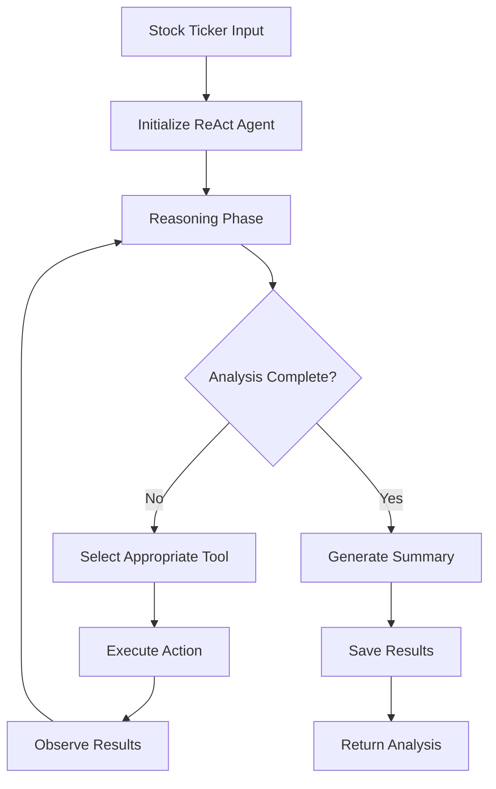

# StockSense Agent

**AI-Powered Autonomous Stock Market Research (ReAct Pattern)**

StockSense is an autonomous stock analysis system implementing the **ReAct (Reasoning + Action)** pattern: iterative reasoning, selective tool invocation, and adaptive summarization. The agent collects real market data (news + historical prices), performs LLM-based sentiment analysis, and produces a structured summary.

[](https://www.python.org/downloads/)
[](https://fastapi.tiangolo.com/)
[](https://react.dev/)
[](https://langchain-ai.github.io/langgraph/)
[](https://python.langchain.com/)
[](LICENSE)

---

## Table of Contents

- [Overview](#overview)
- [Architecture](#architecture)
- [Features](#features)
- [Quick Start](#quick-start)
- [API Reference](#api-reference)
- [Testing](#testing)
- [Deployment](#deployment)
- [Contributing](#contributing)
- [License](#license)
- [Acknowledgments](#acknowledgments)
- [Technical Highlights](#technical-highlights)
- [Author](#author)

---

## Overview

StockSense is not a simple chatbot wrapper — it's a **production-grade agentic AI system** that demonstrates advanced patterns in autonomous reasoning, multi-agent coordination, and real-time streaming.

### What Makes This Different

Most AI stock analysis tools send a single prompt and return a response. StockSense takes a fundamentally different approach:

| Traditional Approach | StockSense Approach |
|---------------------|---------------------|
| Single prompt → single response | Iterative reasoning loop with multiple tool calls |
| One perspective | Multiple agents with opposing viewpoints |
| Binary recommendations | Probability-weighted scenario analysis |
| No self-critique | Built-in anti-sycophancy mechanisms |
| Static output | Real-time streaming of reasoning process |

### Key Innovations

- **ReAct Pattern**: Agent reasons step-by-step, deciding what tools to call based on current knowledge
- **Multi-Agent Debate**: Bull, Bear, and Skeptic agents argue and challenge each other's claims
- **Evidence Grading**: Claims are scored by data support and rebuttal strength, not just LLM confidence
- **Information Asymmetry**: Same data presented differently to each agent, mimicking real analyst teams
- **Kill Criteria Monitoring**: Autonomous watchman that alerts when investment theses are invalidated

---

## Architecture

### Technology Stack

| Layer            | Technology                               | Purpose                             |
| ---------------- | ---------------------------------------- | ----------------------------------- |
| **LLM / AI**     | Google Gemini 2.0 Flash Lite (LangChain) | Sentiment & reasoning               |
| **Agent Graph**  | LangGraph (StateGraph)                   | Iterative reasoning & tool routing  |
| **Tool Layer**   | LangChain `@tool` functions              | News, price, sentiment, persistence |
| **Backend**      | FastAPI + Uvicorn                        | REST API (analysis, cache, health)  |
| **Frontend**     | React + TypeScript + Vite                | Modern interactive dashboard        |
| **Persistence**  | Supabase (PostgreSQL)                    | Analysis cache + User data          |
| **Data Sources** | NewsAPI + yfinance (Yahoo Finance data)  | Headlines + OHLCV price history     |
| **Config / Env** | `python-dotenv`                          | API key management                  |

### ReAct Agent Workflow



### Project Structure

```
StockSense-Agent/
├── frontend/                # React + TypeScript frontend
│   ├── src/
│   │   ├── components/      # UI components (ResultsTabs, DebateView, etc.)
│   │   ├── hooks/           # Custom hooks (useStreamingDebate, useStreamingAnalysis)
│   │   ├── pages/           # Page components (ThesesPage)
│   │   ├── api/             # API hooks and clients
│   │   ├── context/         # React contexts (Auth, Sidebar, Theme)
│   │   └── types/           # TypeScript type definitions
│   └── package.json
├── stocksense/              # Python backend (modular architecture)
│   ├── main.py              # FastAPI server (slim entry point)
│   ├── scheduler.py         # APScheduler background jobs
│   ├── agents/              # 🧠 Adversarial agent system
│   │   ├── base_agent.py    # AgentToolConfig + Information Asymmetry
│   │   ├── bull_analyst.py  # Growth-focused analyst
│   │   ├── bear_analyst.py  # Risk-focused analyst
│   │   ├── synthesizer.py   # Impartial judge + Evidence Grader
│   │   └── skeptic_agent.py # Contrarian skeptic analysis
│   ├── core/                # 🔧 Data & validation utilities
│   │   ├── data_collectors.py  # NewsAPI + yfinance helpers
│   │   ├── analyzer.py      # Sentiment analysis (Gemini)
│   │   ├── validation.py    # Ticker validation
│   │   ├── config.py        # LLM/Chat factories
│   │   ├── schemas.py       # Pydantic schemas
│   │   └── monitor.py       # Kill criteria monitoring
│   ├── db/                  # 💾 Database layer (Supabase)
│   │   ├── models.py        # Schema documentation
│   │   ├── database.py      # Supabase analysis cache
│   │   └── supabase_client.py  # Supabase user data
│   ├── api/                 # 🌐 API routes
│   │   └── auth_routes.py   # User auth, theses, kill alerts
│   └── orchestration/       # 🎭 Flow control
│       ├── react_flow.py    # ReAct + debate orchestration
│       └── streaming.py     # SSE streaming generators
├── supabase/
│   ├── schema.sql           # Database schema for user data
│   └── migrations/          # Database migrations
├── tests/
│   ├── test_api.py          # API integration tests
│   ├── test_tools.py        # Tool logic tests
│   └── test_scheduler.py    # Background job tests
├── requirements.txt         # Backend dependencies
└── requirements-backend.txt # Pin-locked backend dependencies
```

---

## Features

### 🤖 Autonomous ReAct Agent

Unlike simple prompt-and-response systems, StockSense implements a true reasoning loop:

1. **Observe** → Agent receives ticker input and current state
2. **Reason** → LLM decides what information is needed
3. **Act** → Appropriate tool is invoked (news, prices, sentiment)
4. **Reflect** → Results are evaluated; loop continues or terminates

This creates an agent that *thinks before it answers* rather than generating responses in a single pass.

### 🧠 Multi-Agent Adversarial System

The core innovation is a **team of specialized AI agents** that debate each other:

| Agent | Role | Focus Areas |
|-------|------|-------------|
| **Bull Analyst** | Builds the investment case | Revenue growth, market expansion, analyst upgrades, competitive wins |
| **Bear Analyst** | Identifies risks and red flags | Debt levels, margin compression, valuation concerns, competitive threats |
| **Skeptic Agent** | Challenges the primary analysis | Contrarian views, hidden assumptions, information gaps |
| **Synthesizer** | Renders final verdict | Weighs evidence, grades claims, outputs probability-weighted scenarios |

Each agent is **not just a different prompt** — they receive the same underlying data but with different priority ordering, creating genuine analytical diversity.

### ⚔️ Anti-Sycophancy Architecture

AI models tend to agree with users or produce overly optimistic outputs. StockSense addresses this with:

**1. Information Asymmetry**
- Bull Analyst sees growth metrics first (revenue, forward P/E, targets)
- Bear Analyst sees risk metrics first (debt, margins, valuation)
- Same data, different cognitive emphasis — mimics real investment teams

**2. Mandatory Rebuttal Round**
- After initial cases are built, agents must critique each other
- Each claim is challenged with specific counter-evidence
- Forces identification of weaknesses, not just strengths

**3. Evidence Grader Protocol**
- The Synthesizer grades each claim by:
  - **Data Support Score**: How well does hard data back this claim?
  - **Rebuttal Strength**: How effectively was it challenged?
  - **Final Credibility**: Adjusted confidence after cross-examination

**4. Probability-Weighted Verdicts**
- Output is not binary (buy/sell) but three scenarios:
  - Bull Case probability (what if growth exceeds expectations?)
  - Base Case probability (what if nothing dramatic happens?)
  - Bear Case probability (what if risks materialize?)

### 📊 Market Data & Sentiment

- Real-time headline aggregation via NewsAPI
- Historical OHLCV price data via yfinance
- Per-headline sentiment classification with confidence scores
- Structured output: themes, risks, information gaps

### 📝 User Belief System

Investment theses are first-class citizens, not just analysis outputs:

- **Thesis Creation**: Document your investment rationale and entry criteria
- **Kill Criteria**: Define what would invalidate your thesis (e.g., "revenue growth < 10%")
- **Automated Monitoring**: Scheduler checks theses against latest analysis
- **Alert System**: Get notified when kill criteria are triggered
- **Thesis History**: Track how your thinking evolved over time

### ⚙️ Production-Ready Infrastructure

- **FastAPI Backend**: Async endpoints, rate limiting, structured error handling
- **React Frontend**: TypeScript, real-time streaming, responsive design
- **Supabase**: PostgreSQL persistence, Row-Level Security, authentication
- **SSE Streaming**: Watch the agent think in real-time as it reasons through analysis

---

## Quick Start

### Prerequisites

- Python 3.10+
- Node.js 18+ (for frontend)
- [Google Gemini API Key](https://aistudio.google.com/app/apikey)
- [NewsAPI Key](https://newsapi.org/register)
- [Supabase Project](https://supabase.com/) (required for all features)

### Installation

```bash
# Clone the repository
git clone https://github.com/Spkap/StockSense-Agent.git
cd StockSense-Agent

# Backend setup
python -m venv venv
source venv/bin/activate  # On Windows: venv\Scripts\activate
pip install -r requirements-backend.txt

# Frontend setup
cd frontend
npm install  # or pnpm install
cd ..

# Environment variables
cp .env.example .env
# Edit .env with your actual API keys:
# - GOOGLE_API_KEY
# - NEWSAPI_KEY
# - SUPABASE_URL
# - SUPABASE_ANON_KEY
# - SUPABASE_SERVICE_KEY

# Apply Supabase migrations (run in Supabase SQL Editor)
# 1. supabase/schema.sql
# 2. supabase/migrations/003_analysis_cache.sql
```

### Running the Application

```bash
# Terminal 1 – Backend API
python -m stocksense.main  # http://127.0.0.1:8000

# Terminal 2 – Frontend
cd frontend
npm run dev  # http://localhost:5173
```

### Quick API Test

```bash
# Trigger ReAct agent analysis
curl -X POST "http://localhost:8000/analyze/AAPL"

# Retrieve cached results
curl "http://localhost:8000/results/AAPL"

# System health check
curl "http://localhost:8000/health"

# Get all cached tickers
curl "http://localhost:8000/cached-tickers"
```

### Example Response

```json
{
  "ticker": "AAPL",
  "summary": "Apple Inc. demonstrates strong market sentiment...",
  "sentiment_report": "Overall Sentiment: Positive ...",
  "headlines_count": 18,
  "overall_sentiment": "Bullish",
  "overall_confidence": 0.78,
  "key_themes": [...],
  "skeptic_report": "While sentiment is positive, consider...",
  "reasoning_steps": [...],
  "tools_used": ["fetch_news_headlines", "fetch_price_data", "analyze_sentiment", "generate_skeptic_critique"],
  "iterations": 4,
  "agent_type": "ReAct"
}
```

---

## API Reference

### Analysis Endpoints

| Method | Path                              | Description                              |
| ------ | --------------------------------- | ---------------------------------------- |
| POST   | `/analyze/{ticker}`               | Run ReAct agent analysis (fresh/cached)  |
| GET    | `/analyze/{ticker}/stream`        | SSE stream of analysis progress          |
| GET    | `/analyze/debate/{ticker}`        | Run adversarial Bull/Bear debate         |
| GET    | `/analyze/debate/{ticker}/stream` | SSE stream of debate progress            |
| GET    | `/results/{ticker}`               | Latest cached summary & sentiment        |
| DELETE | `/results/{ticker}`               | Delete cached analysis                   |
| GET    | `/cached-tickers`                 | List all cached tickers                  |

### System Endpoints

| Method | Path      | Description                     |
| ------ | --------- | ------------------------------- |
| GET    | `/health` | Health check with dependencies  |
| GET    | `/`       | Root endpoint with API info     |
| GET    | `/docs`   | Swagger UI (OpenAPI)            |

### User Endpoints (Auth Required)

| Method | Path                       | Description                    |
| ------ | -------------------------- | ------------------------------ |
| GET    | `/api/me`                  | Current user profile           |
| GET    | `/api/positions`           | User's portfolio positions     |
| POST   | `/api/positions`           | Add portfolio position         |
| DELETE | `/api/positions/{id}`      | Remove position                |
| GET    | `/api/theses`              | User's investment theses       |
| POST   | `/api/theses`              | Create investment thesis       |
| PATCH  | `/api/theses/{id}`         | Update thesis                  |
| GET    | `/api/theses/{id}/history` | Thesis revision history        |
| GET    | `/api/theses/{id}/compare` | Compare thesis to analysis     |
| GET    | `/api/kill-alerts`         | User's kill criteria alerts    |
| PATCH  | `/api/kill-alerts/{id}`    | Update alert status            |
| DELETE | `/api/kill-alerts/{id}`    | Delete alert                   |

---

## Testing

```bash
# Run all tests (requires backend deps installed)
pytest -v

# Run specific test modules
pytest tests/test_api.py -v
pytest tests/test_tools.py -v

# Run with coverage report
pytest --cov=stocksense --cov-report=term-missing
```

---

## Deployment

### Backend (Render)

Deploy the FastAPI backend to Render using the included `render.yaml`:

```bash
# render.yaml is pre-configured for Render deployment
# Set environment variables in Render dashboard
```

### Frontend (Vercel/Netlify)

```bash
cd frontend
npm run build  # Produces dist/ folder
```

Set `VITE_API_URL` environment variable to your backend URL.

---

## Contributing

Contributions are welcome! Please follow these steps:

1. Fork the repository
2. Create a feature branch (`git checkout -b feature/amazing-feature`)
3. Commit your changes (`git commit -m 'Add amazing feature'`)
4. Push to the branch (`git push origin feature/amazing-feature`)
5. Open a Pull Request

Please ensure your code:
- Passes all existing tests
- Includes tests for new functionality
- Follows the existing code style

---

## License

This project is licensed under the **Apache License 2.0** - see the [LICENSE](LICENSE) file for details.

This means you can:
- ✅ Use commercially
- ✅ Modify and distribute
- ✅ Use patents
- ⚠️ Must include license and copyright notice
- ⚠️ Must state changes made

---

## Acknowledgments

- [LangChain](https://python.langchain.com/) & [LangGraph](https://langchain-ai.github.io/langgraph/) for the agent framework
- [Google Gemini](https://deepmind.google/technologies/gemini/) for LLM capabilities
- [Supabase](https://supabase.com/) for authentication and database
- [NewsAPI](https://newsapi.org/) for news headlines
- [yfinance](https://github.com/ranaroussi/yfinance) for market data

---

## Technical Highlights

- **LangGraph Workflow**: Agent node + tool node + conditional edge architecture
- **State Management**: Tracks tools used, reasoning steps, iterations, messages
- **Deduplication**: Prevents redundant tool invocations (sentiment/news/price)
- **Epistemic Honesty**: Confidence scores, information gaps, skeptic critique
- **Rate Limit Handling**: Gemini rate limits produce user-friendly summaries

### Disclaimer

> Example outputs are illustrative; actual results depend on live NewsAPI & yfinance data plus Gemini responses. This tool is for educational and research purposes only—not financial advice.

---

## Author

**Sourabh Kapure**

[](https://github.com/Spkap)
[](https://www.linkedin.com/in/sourabhkapure/)
[](https://x.com/sourabhkapure)
[](mailto:sourabhkapure@gmail.com)

If you found this project helpful, consider giving it a ⭐!

---

**Built with ❤️ by Sourabh Kapure**
