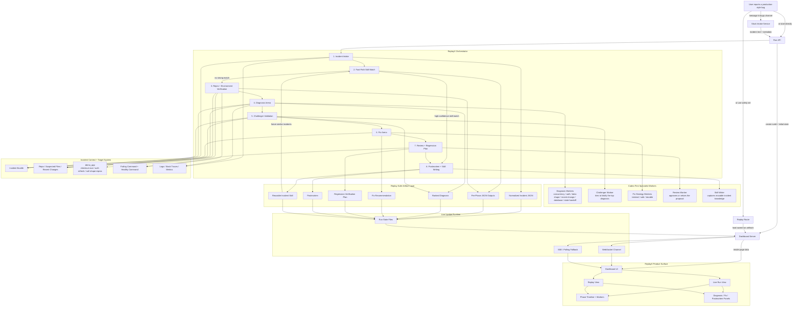

# ReplayX Flow Architecture

This is the simplest walkthrough version of ReplayX based on the actual app. It shows how an incident enters the system, how the orchestrator moves through bounded phases, how the dashboard gets live updates, and how ReplayX preserves reusable incident memory.

## Walkthrough

1. A bug is reported in Slack or a run is started directly through the run API.
2. ReplayX creates a live run, persists the run state, and opens the dashboard flow.
3. The dashboard server pushes live progress over WebSockets, with SSE or polling as fallback.
4. The orchestrator moves through a fixed sequence: intake, skill match, repro, diagnosis, challenger, fix arena, review, and postmortem.
5. The diagnosis arena uses bounded Codex-first workers instead of one large opaque agent run.
6. Those workers inspect the incident bundle, repo context, demo app behavior, and verification commands.
7. The challenger tries to falsify weak diagnoses before ReplayX accepts a root cause.
8. The fix arena ranks fix strategies by blast radius and durability rather than patching blindly.
9. Every phase writes machine-readable artifacts so the run is inspectable and replayable.
10. At the end, ReplayX emits not just a diagnosis, but also a verification plan, a postmortem, and a reusable skill for future incidents.
